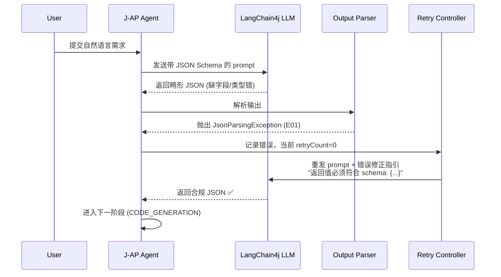
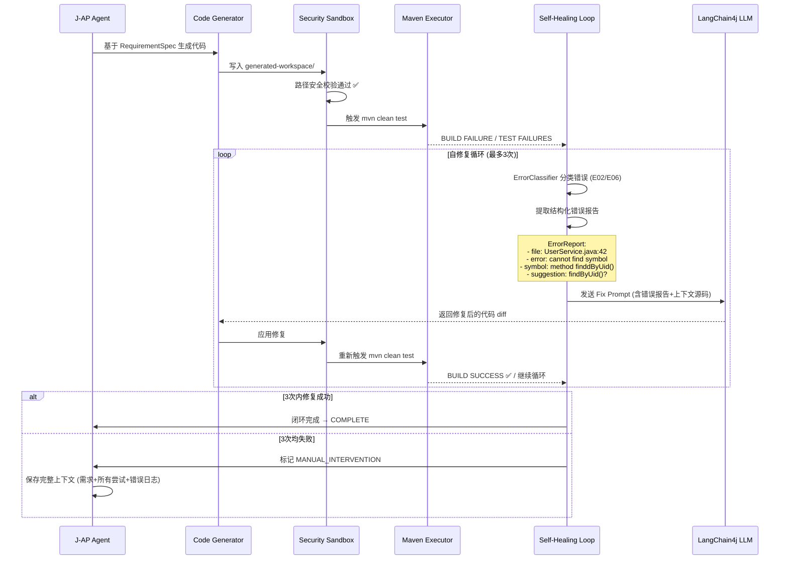
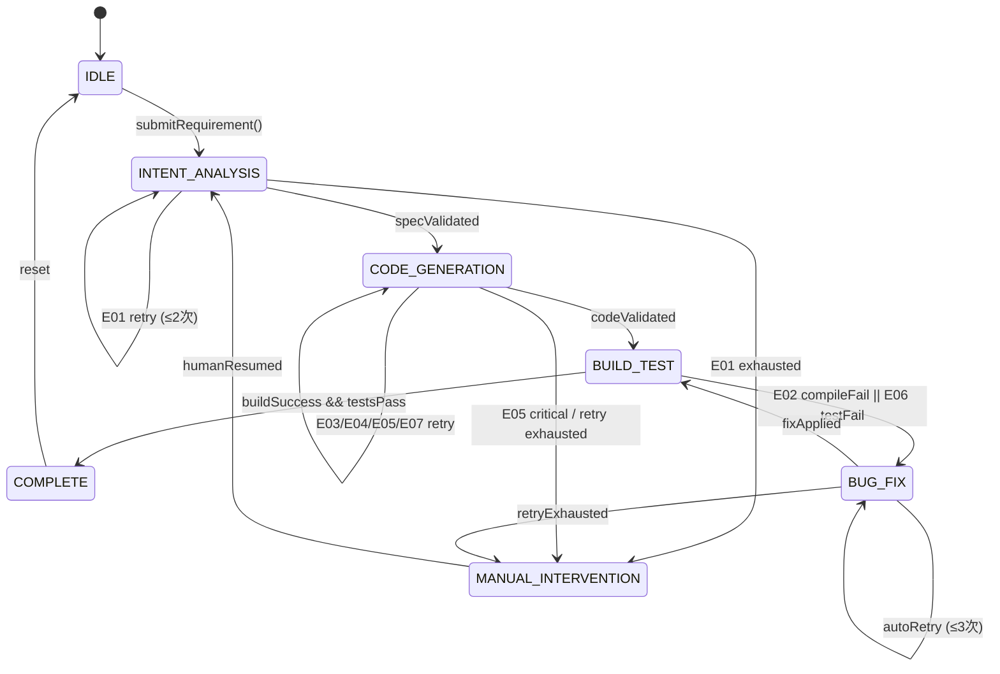
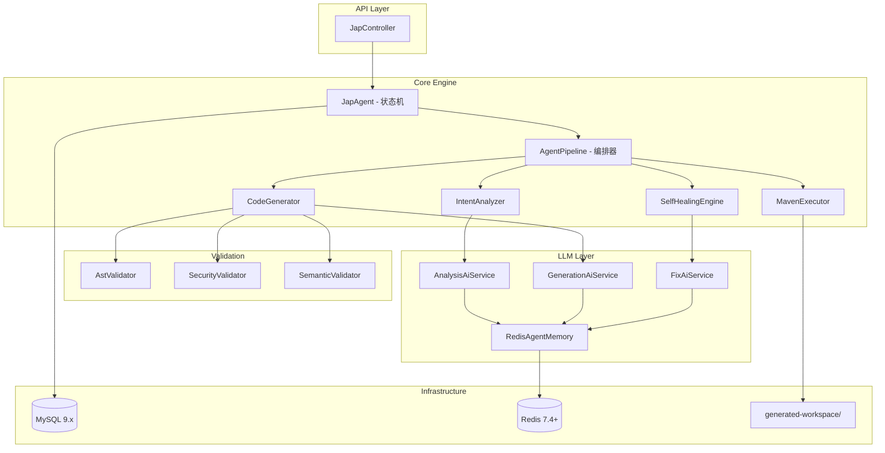

# J-AP (J-Architect-Pilot) 2026 — 产品需求规格说明书 (PRD)

> **文档版本**: v1.0.0  
> **阶段**: 第一阶段 — 意图矩阵 (Intent Matrix)  
> **日期**: 2026-04-04  
> **状态**: 待评审

---

## 1. 产品概述

### 1.1 产品定位

J-AP (J-Architect-Pilot) 是一款基于 **LangChain4j 1.0.0** 的工业级 Java AI Agent 引擎，旨在实现**自主软件工程闭环**：

```
用户需求 → 需求分析 → 代码生成 → 构建测试 → 缺陷修复 → 交付
```

Agent 必须具备以下核心能力：
- 理解自然语言需求并输出结构化技术规格
- 生成符合 **Jakarta EE 11** 规范的 Java 源码（Spring Boot 3.4.x）
- 自主执行 **Maven** 编译与测试
- 根据构建/测试反馈**自主修复缺陷**
- 全程运行在**安全沙盒**内

### 1.2 技术基准矩阵

| 维度 | 技术选型 | 版本要求 | 关键特性 |
|------|---------|---------|---------|
| Runtime | JDK | **25 (LTS)** | Structured Concurrency (JEP 462) |
| Framework | Spring Boot | **3.4.x** | `spring.threads.virtual.enabled=true` 虚拟线程 |
| Agent Engine | LangChain4j | **1.0.0 (Stable)** | AiServices 声明式 Agent + Tool Calling |
| Persistence (Memory) | Redis | **7.4+** | Agent 对话记忆持久化 |
| Persistence (State) | H2 / MySQL | **9.x** | 任务状态、构建记录存储 |
| 规范标准 | Jakarta EE | **11** | 包名 `jakarta.*`，禁止 `javax.*` |

### 1.3 安全边界

```
项目根目录: d:\GitProgram\J-AP\
├── src/                    ← J-AP 自身源码（只读执行）
├── generated-workspace/    ← Agent 生成代码的唯一合法目录（读写）
└── ...                     ← 其余目录：Agent 无权访问
```

**强制规则**: Agent 生成的代码只能操作 `generated-workspace/` 文件夹内的资源。任何越权访问必须被安全沙盒拦截。

---

## 2. 核心挑战：模型返回垃圾数据的异常流

### 2.1 问题定义

LLM 的非确定性输出是 Agent 自主闭环的最大威胁。模型可能返回：
- 格式错误的 JSON（不符合 Tool Calling Schema）
- 含语法错误的 Java 代码
- 幻觉内容（引用不存在的 API / 类名）
- 越权操作代码（尝试访问 sandbox 外资源）
- 恶意或无意义的输出

**如果缺乏完善的异常流处理，任何一个环节的垃圾数据都会导致整个闭环级联失败。**

### 2.2 垃圾数据分类体系

| 分类编号 | 异常类型 | 触发场景 | 检测层 | 典型表现 |
|---------|---------|---------|--------|---------|
| **E01** | 结构化输出格式错误 | LLM 返回 Tool Call 参数时 JSON 畸形 | Layer 0: Output Parser | 缺少必需字段、类型不匹配、非法字符 |
| **E02** | 代码语法错误 | 生成的 Java 源码无法编译 | Layer 2: Maven Compile | `javac` 错误、缺少 import、类型不匹配 |
| **E03** | 规范违规 | 代码不符合 Jakarta EE 11 / 项目规约 | Layer 1: AST Validator | 使用 `javax.*` 包名、命名不规范 |
| **E04** | 幻觉内容 | LLM 编造不存在的 API 或配置 | Layer 1: Semantic Validator | 引用不存在的 Spring Boot 属性、伪造类名 |
| **E05** | 安全域越权 | 代码尝试访问 sandbox 外资源 | Layer 2: Security Sandbox | `File("..")` 路径穿越、`Runtime.exec()` |
| **E06** | 测试逻辑错误 | 代码编译通过但单元测试失败 | Layer 3: Test Runner | 断言失败、空指针、业务逻辑错误 |
| **E07** | 循环依赖/死循环 | 生成代码存在设计缺陷 | Layer 1: AST Analyzer | 类之间循环引用、无限递归 |

### 2.3 分层防御架构 (Defense in Depth)

```
┌─────────────────────────────────────────────────────────────┐
│                    用户输入 (自然语言需求)                      │
└───────────────────────────┬─────────────────────────────────┘
                            ▼
┌─────────────────────────────────────────────────────────────┐
│  Layer 0: LLM 输出层 (Output Parser)                         │
│  ├─ LangChain4j Structured Output (JSON Schema 强约束)        │
│  ├─ AiServices.outputValidator() 格式校验                    │
│  └─ StructuredTaskScope.cancel() 超时控制 (JDK 25)           │
│  拦截: E01 (格式错误)                                        │
└───────────────────────────┬─────────────────────────────────┘
                            ▼
┌─────────────────────────────────────────────────────────────┐
│  Layer 1: 语义校验层 (Semantic Validator)                    │
│  ├─ AST 静态分析 (JavaParser)                                │
│  │   └─ Jakarta EE 11 合规检查 (禁止 javax.*)                │
│  │   └─ 命名约定校验 (遵循 java-dev skill 规约)              │
│  ├─ 事实校验 (Fact Checker)                                  │
│  │   └─ API 存在性验证 (对照项目依赖列表)                     │
│  │   └─ RAG 上下文一致性检查                                  │
│  └─ 设计缺陷检测                                             │
│      └─ 循环依赖检测 (E07)                                   │
│      └─ 死循环模式识别                                       │
│  拦截: E03, E04, E07                                        │
└───────────────────────────┬─────────────────────────────────┘
                            ▼
┌─────────────────────────────────────────────────────────────┐
│  Layer 2: 安全沙盒层 (Security Sandbox)                      │
│  ├─ 文件系统沙盒                                             │
│  │   └─ Path.normalize() + 前缀校验 (generated-workspace/)   │
│  │   └─ SecurityManager / Custom ClassLoader 隔离            │
│  ├─ 进程执行沙盒                                             │
│  │   └─ Maven 在隔离进程中执行 (ProcessBuilder)               │
│  │   └─ 网络访问白名单 (仅允许 Maven Repository)             │
│  └─ ClassLoader 隔离                                         │
│      └─ 生成的代码在独立 URLClassLoader 中加载和运行          │
│  拦截: E05 (安全越权)                                        │
└──────────────────────────�──────────────────────────────────┘
                            ▼
┌─────────────────────────────────────────────────────────────┐
│  Layer 3: 构建测试门禁 (Build Gate)                          │
│  ├─ Maven compile (编译门禁)                                 │
│  │   └─ 捕获 E02 (语法错误) → 结构化错误报告                 │
│  ├─ Maven test (测试门禁)                                    │
│  │   └─ 捕获 E06 (测试失败) → 结构化失败报告                  │
│  │   └─ Surefire/JUnit5 报告解析                             │
│  └─ 超时控制                                                 │
│      └─ 单次构建超时 120s                                     │
│  拦截: E02, E06                                              │
└───────────────────────────┬─────────────────────────────────┘
                            ▼
┌─────────────────────────────────────────────────────────────┐
│  Layer 4: 自修复循环 (Self-Healing Loop)                     │
│  ├─ 错误分类器 (Error Classifier)                             │
│  │   └─ 将原始错误映射到 E01~E07 分类                        │
│  │   └─ 提取关键错误信息 (文件名、行号、错误消息)             │
│  ├─ 修复提示生成器 (Fix Prompt Generator)                    │
│  │   └─ 将结构化错误转化为 LLM 可理解的修复指令               │
│  │   └─ 附带上文信息 (相关源码片段、错误堆栈)                 │
│  ├─ 重试控制器 (Retry Controller)                             │
│  │   └─ 最大重试次数: 3 次                                   │
│  │   └─ 指数退避: 1s → 2s → 4s                              │
│  │   └─ 不同错误类型的重试策略差异化                          │
│  └─ 降级策略                                                 │
│      └─ 超过最大重试 → MANUAL_INTERVENTION                   │
│      └─ 保留完整上下文供人工审查                              │
└───────────────────────────┬─────────────────────────────────┘
                            ▼
┌─────────────────────────────────────────────────────────────┐
│                   COMPLETE (闭环成功) / MANUAL_INTERVENTION  │
└─────────────────────────────────────────────────────────────┘
```

### 2.4 异常流详细处理流程

#### 流程 A: E01 — 结构化输出格式错误



**处理策略**:
- 自动重试，附带 schema 纠错提示
- 最大重试: 2 次（格式问题通常可快速纠正）
- 超过重试上限 → 降级为 MANUAL_INTERVENTION

#### 流程 B: E02/E06 — 编译错误 / 测试失败（核心自修复流）



**ErrorReport 结构（发送给 LLM 的修复指令）**:

```json
{
  "errorCategory": "E02",
  "phase": "COMPILE",
  "file": "generated-workspace/src/main/java/com/example/service/UserService.java",
  "line": 42,
  "errorCode": "cannot find symbol",
  "details": {
    "symbol": "method finddByUid()",
    "location": "class UserRepository",
    "suggestion": "Did you mean: findByUid()?"
  },
  "contextSource": {
    "startLine": 38,
    "endLine": 46,
    "snippet": "    public UserDto getUser(String uid) {\n        User entity = userRepository.finddByUid(uid);\n        // ...\n    }"
  },
  "retryCount": 1,
  "maxRetries": 3
}
```

#### 流程 C: E05 — 安全域越权

```mermaid
sequenceDiagram
    participant Agent as J-AP Agent
    participant Gen as Code Generator
    participant SecCheck as Security Validator
    participant LLM as LangChain4j LLM

    Agent->>Gen: 生成代码
    Gen->>SecCheck: 安全扫描
    SecCheck->>SecCheck: 检测到路径穿越攻击
    Note over SecCheck: File file = new File("../etc/passwd");<br/>→ normalize 后路径不在 generated-workspace/ 下
    SecCheck-->>Agent: SecurityViolationException (E05)<br/>severity=CRITICAL

    Agent->>LLM: 发送安全错误修复指令<br/>"生成的代码违反安全规则:<br/>1. 禁止访问 generated-workspace/ 以外的路径<br/>2. 请使用相对路径，基础路径已设为 workspace"
    LLM-->>Gen: 返回修复后的代码 (移除越权操作)
    Gen->>SecCheck: 重新扫描
    SecCheck-->>Agent: SECURITY_CHECK_PASSED ✅
```

**E05 特殊处理规则**:
- **severity = CRITICAL**: 不进入普通重试池，立即阻断并强制修复
- **不计入普通重试次数**: 安全问题是零容忍项
- **修复失败超过 2 次**: 直接终止任务，记录安全审计日志

---

## 3. Agent 自主闭环状态机

### 3.1 状态定义

| 状态 | 英文标识 | 说明 | 入口条件 | 出口条件 |
|------|---------|------|---------|---------|
| 空闲 | `IDLE` | Agent 等待任务 | 系统启动 / 任务完成 | 收到用户需求 |
| 意图分析 | `INTENT_ANALYSIS` | 分析需求，输出结构化规格 | 收到需求 | RequirementSpec 校验通过 |
| 代码生成 | `CODE_GENERATION` | 生成完整 Maven 项目源码 | Spec 就绪 | 代码通过 AST + 安全校验 |
| 构建测试 | `BUILD_TEST` | 执行 Maven 编译和测试 | 代码就绪 | 编译通过 + 测试全绿 |
| 缺陷修复 | `BUG_FIX` | 根据错误报告修复代码 | 构建/测试失败 | 重新构建测试通过 / 达到重试上限 |
| 完成 | `COMPLETE` | 闭环成功 | 构建测试通过 | — |
| 人工介入 | `MANUAL_INTERVENTION` | 需要人工干预 | 重试耗尽 / 安全严重违规 | 人工处理后恢复 |

### 3.2 状态流转图



### 3.3 各阶段详细规格

#### 3.3.1 INTENT_ANALYSIS — 意图分析

**目标**: 将自然语言需求转化为结构化的 `RequirementSpec`

**输入**:
```json
{
  "userRequirement": "实现一个用户管理的 RESTful API，支持 CRUD 操作，使用 MySQL 存储，需要分页查询",
  "context": {
    "techStack": "spring-boot-3.4, langchain4j-1.0.0",
    "conventions": "jakarta.ee.11, project-naming-rules"
  }
}
```

**输出** (`RequirementSpec`):
```json
{
  "specId": "req-20260404-001",
  "moduleName": "user-management",
  "description": "User CRUD RESTful API with pagination",
  "modules": [
    {
      "name": "user-controller",
      "type": "REST_CONTROLLER",
      "path": "com.example.user.controller.UserController",
      "endpoints": [
        { "method": "POST", "/api/users", "description": "创建用户" },
        { "method": "GET", "/api/users/{id}", "description": "根据ID查询" },
        { "method": "GET", "/api/users", "description": "分页查询用户列表" },
        { "method": "PUT", "/api/users/{id}", "description": "更新用户" },
        { "method": "DELETE", "/api/users/{id}", "description": "删除用户" }
      ]
    },
    {
      "name": "user-service",
      "type": "SERVICE",
      "path": "com.example.user.service.UserService"
    },
    {
      "name": "user-repository",
      "type": "REPOSITORY",
      "path": "com.example.user.repository.UserRepository",
      "database": "MySQL 9.x"
    },
    {
      "name": "user-dto",
      "type": "DTO",
      "path": "com.example.user.dto"
    },
    {
      "name": "user-entity",
      "type": "ENTITY",
      "path": "com.example.user.entity.User",
      "table": "t_user"
    }
  ],
  "dependencies": [
    "org.springframework.boot:spring-boot-starter-web:3.4.x",
    "org.springframework.boot:spring-boot-starter-data-jpa:3.4.x",
    "com.mysql:mysql-connector-j:9.x"
  ],
  "testStrategy": {
    "framework": "JUnit 5",
    "coverage": "service layer + controller layer",
    "mock": "Mockito for repository layer"
  }
}
```

**异常处理**:
| 场景 | 处理方式 |
|------|---------|
| LLM 返回 JSON 格式错误 (E01) | `outputValidator` 拦截 → 重试（附 schema 提示）→ 最多 2 次 |
| 输出缺少关键字段 | 补充默认值 + 标记 `confidence: LOW` |
| 需求含糊无法结构化 | 向用户提问澄清（交互式意图确认） |
| 超时 (JDK 25 Scope.cancel()) | 取消子任务 → 返回超时错误 → 降级 |

**JDK 25 特性应用**:
```java
try (var scope = new StructuredTaskScope.ShutdownOnFailure()) {
    Subtask<RequirementSpec> analysis = scope.fork(() -> aiService.analyzeRequirement(requirement));
    Subtask<TechContext> context = scope.fork(() -> techContextService.resolve(requirement));
    
    scope.join().throwIfFailed();
    
    return merge(analysis.get(), context.get());
}
```

#### 3.3.2 CODE_GENERATION — 代码生成

**目标**: 根据 `RequirementSpec` 在 `generated-workspace/` 下生成完整的 Maven 项目

**生成清单**:

| 文件 | 说明 | 校验规则 |
|------|------|---------|
| `pom.xml` | Maven 构建文件 | 依赖版本合法性、groupId/artifactId 格式 |
| `src/main/java/**/entity/*.java` | JPA Entity | `@Entity`, Jakarta EE 类型, Lombok 规范 |
| `src/main/java/**/repository/*.java` | Spring Data Repository | 继承 `JpaRepository`, 方法命名规范 |
| `src/main/java/**/service/*.java` | Service 层 | 构造函数注入, `@Transactional` |
| `src/main/java/**/controller/*.java` | REST Controller | `@RestController`, `@RequestMapping`, 参数校验 |
| `src/main/java/**/dto/*.java` | DTO/VO | Lombok `@Data`, JSR-380 校验注解 |
| `src/main/resources/application.yml` | 配置文件 | 数据源配置, 合法属性名 |
| `src/test/java/**/*.java` | 单元测试 | JUnit 5, `@DisplayName`, given-when-then |

**多层校验流程**:

```
生成代码
  ↓
[AST 校验] ──→ import 是否全部来自 jakarta.*? (E03 检测)
  ↓           → 命名是否符合约定? (大驼峰类名, 小驼峰方法)
  ↓           → 是否有循环依赖? (E07 检测)
[语义校验] ──→ 引用的 API 是否存在于依赖中? (E04 检测)
  ↓           → Spring Boot 属性名是否合法?
[安全扫描] ──→ 是否有 File/Path 操作? 检查路径是否在 sandbox 内 (E05)
  ↓           → 是否有 Runtime.exec() / ProcessBuilder? (E05)
  ↓
全部通过 → 进入 BUILD_TEST
任一失败 → 进入对应错误处理分支
```

**Spring Boot 3.4.x 虚拟线程应用**:
```java
@Bean
public ApplicationRunner codeGenerationRunner(CodeGenerator generator) {
    return args -> {
        List<ModuleSpec> modules = requirementSpec.getModules();
        
        try (var executor = Executors.newVirtualThreadPerTaskExecutor()) {
            List<Future<GeneratedModule>> futures = modules.stream()
                .map(module -> executor.submit(() -> generator.generate(module)))
                .toList();
            
            for (Future<GeneratedModule> future : futures) {
                GeneratedModule result = future.get(); 
                validate(result);
            }
        }
    };
}
```

#### 3.3.3 BUILD_TEST — 构建测试

**目标**: 在隔离环境中执行 Maven 构建和测试

**执行环境**:
```java
public class MavenExecutor {
    private static final Path WORKSPACE = Path.of("generated-workspace");
    private static final Duration BUILD_TIMEOUT = Duration.ofSeconds(120);
    
    public BuildResult executeBuild(Path projectDir) {
        ProcessBuilder pb = new ProcessBuilder(
            "mvn", "clean", "test", "-B", "-q"
        );
        pb.directory(projectDir.toFile());
        pb.redirectErrorStream(true);
        
        try {
            Process process = pb.start();
            
            boolean completed = process.waitFor(BUILD_TIMEOUT.toSeconds(), TimeUnit.SECONDS);
            if (!completed) {
                process.destroyForcibly();
                return BuildResult.timeout("Maven build exceeded 120s limit");
            }
            
            int exitCode = process.exitValue();
            String output = readProcessOutput(process);
            
            return exitCode == 0 
                ? BuildResult.success(output)
                : BuildResult.failure(parseErrors(output));
                
        } catch (IOException | InterruptedException e) {
            return BuildResult.error(e);
        }
    }
}
```

**错误解析策略**:

| 错误来源 | 解析方式 | 输出结构 |
|---------|---------|---------|
| javac 编译错误 | 正则匹配 `/([^:]+):(\d+):\s*error:\s*(.+)/` | `{file, line, errorCode, details}` |
| Maven 依赖解析失败 | 匹配 `Could not find artifact` | `{missingArtifact, suggestedVersion}` |
| JUnit5 测试失败 | 解析 Surefire XML 报告 | `{testClass, testName, failureType, message, stackTrace}` |
| Spring Context 启动失败 | 匹配 `Application run failed` / `BeanCreationException` | `{beanName, cause, relatedConfig}` |

#### 3.3.4 BUG_FIX — 缺陷修复（自愈引擎）

**这是 J-AP 最核心的差异化能力。**

**修复流水线**:

```
BuildResult (FAILURE)
       ↓
┌──────────────────────┐
│   Error Classifier    │ ← 将原始错误映射到 E01~E07
│   - 正则匹配          │
│   - 上下文推断        │
│   - 严重程度评估      │
└──────────┬───────────┘
           ↓
┌──────────────────────┐
│  Context Collector    │ ← 收集修复所需上下文
│  - 错误文件源码       │
│  - 相关依赖的 API     │
│  - 历史修复记录       │
│  - RequirementSpec    │
└──────────┬───────────┘
           ↓
┌──────────────────────┐
│  Fix Prompt Generator │ ← 生成结构化修复指令
│  - 错误描述           │
│  - 期望行为           │
│  - 约束条件           │
│  - 参考示例 (可选)    │
└──────────┬───────────┘
           ↓
┌──────────────────────┐
│   LLM Fix Request     │ ← 发送给 LangChain4j
│   - role: fixer       │
│   - systemPrompt:     │
│     "你是Java修复专家" │
│   - userMessage:      │
│     (Fix Prompt)      │
└──────────┬───────────┘
           ↓
┌──────────────────────┐
│   Patch Applier       │ ← 应用修复补丁
│   - diff 格式解析     │
│   - 冲突检测          │
│   - 回滚能力          │
└──────────┬───────────┘
           ↓
    重新进入 BUILD_TEST
```

**Fix Prompt 示例** (E02 编译错误):

```text
[System] 你是 Java 代码修复专家。请修复以下编译错误。

[Error Report]
- Category: E02 (Compilation Error)
- File: generated-workspace/src/main/java/com/example/service/UserService.java
- Line: 42
- Error: cannot find symbol
  symbol: method finddByUid(java.lang.String)
  location: class com.example.repository.UserRepository
- Suggestion: Did you mean: findByUid?

[Faulty Code (lines 38-46)]
```java
public UserDto getUser(String uid) {
    User entity =userRepository.finddByUid(uid);
    return userMapper.toDto(entity);
}
```

[Available APIs in UserRepository]
- findById(Long id): Optional<User>
- findByUid(String uid): Optional<User>
- findAll(Pageable pageable): Page<User>
- save(User user): User
- deleteById(Long id): void

[Constraints]
1. 只修改有错误的行，不要重构其他代码
2. 保持 Jakarta EE 11 规范 (jakarta.*)
3. 保持 Lombok 注解风格 (@RequiredArgsConstructor)
4. 不要添加新的方法签名

[Expected Output]
提供修复后的完整方法代码。
```

**重试策略矩阵**:

| 错误类型 | 最大重试 | 退避策略 | 特殊处理 |
|---------|---------|---------|---------|
| E01 (格式错误) | 2 次 | 固定 1s | 附 schema 提示 |
| E02 (编译错误) | 3 次 | 指数 1s→2s→4s | 附错误行+建议修复 |
| E03 (规范违规) | 2 次 | 固定 1s | 附规范条款引用 |
| E04 (幻觉内容) | 2 次 | 固定 1s | 附正确 API 文档 |
| E05 (安全越权) | 2 次 | 固定 1s | **CRITICAL**, 不计普通重试 |
| E06 (测试失败) | 3 次 | 指数 1s→2s→4s | 附失败断言+期望值 |
| E07 (设计缺陷) | 2 次 | 固定 1s | 附架构建议 |

---

## 4. 系统架构

### 4.1 模块划分 (Jakarta EE 11 包结构)

```
com.jap
├── com.jap.core                    # 核心引擎
│   ├── agent/
│   │   ├── JapAgent.java           # Agent 主控类 (状态机驱动)
│   │   ├── AgentLifecycle.java     # 生命周期管理
│   │   └── AgentContext.java       # Agent 执行上下文
│   ├── intent/
│   │   ├── IntentAnalyzer.java     # 意图分析入口
│   │   ├── RequirementSpec.java    # 需求规格模型
│   │   └── ModuleSpec.java         # 模块规格模型
│   ├── pipeline/
│   │   ├── AgentPipeline.java      # 闭环 Pipeline 编排
│   │   ├── PipelineStage.java      # 阶段枚举
│   │   └── PipelineResult.java     # 阶段执行结果
│   ├── sandbox/
│   │   ├── SandboxManager.java     # 沙盒管理器
│   │   ├── FileSystemSandbox.java  # 文件系统沙盒
│   │   └── ProcessSandbox.java     # 进程执行沙盒
│   └── state/
│       ├── TaskState.java          # 任务状态实体
│       ├── TaskRepository.java     # 任务状态持久化
│       └── StateMachine.java       # 状态机实现
│
├── com.jap.llm                     # LLM 抽象层
│   ├── output/
│   │   ├── StructuredOutputParser.java  # 结构化输出解析
│   │   ├── OutputValidator.java         # 输出校验器
│   │   └── JsonSchemaProvider.java      # JSON Schema 提供
│   ├── tool/
│   │   ├── @ToolCodeGenerator.java     # 代码生成工具
│   │   ├── @ToolMavenExecutor.java      # Maven 执行工具
│   │   ├── @ToolFileReader.java         # 文件读取工具
│   │   └── @ToolFileWriter.java         # 文件写入工具
│   ├── memory/
│   │   ├── AgentMemory.java            # Agent 记忆接口
│   │   ├── RedisAgentMemory.java       # Redis 实现 (Redis 7.4+)
│   │   └── ConversationHistory.java    # 对话历史管理
│   └── service/
│       ├── AnalysisAiService.java      # 分析 AiService
│       ├── GenerationAiService.java    # 生成 AiService
│       └── FixAiService.java           # 修复 AiService
│
├── com.jap.generator                 # 代码生成器
│   ├── JavaSourceGenerator.java       # Java 源码生成
│   ├── PomGenerator.java             # POM 文件生成
│   ├── TestCodeGenerator.java        # 测试代码生成
│   ├── ConfigGenerator.java          # 配置文件生成
│   └── template/                     # 代码模板
│
├── com.jap.validator                 # 多层校验器
│   ├── AstValidator.java            # AST 静态分析校验
│   ├── SemanticValidator.java       # 语义/事实校验
│   ├── SecurityValidator.java       # 安全扫描器
│   ├── NamingConventionValidator.java # 命名校验
│   └── JakartaEEComplianceChecker.java # Jakarta EE 11 合规检查
│
├── com.jap.build                     # 构建执行层
│   ├── MavenExecutor.java           # Maven 执行器
│   ├── BuildResult.java             # 构建结果模型
│   ├── ErrorParser.java             # 错误解析器
│   ├── TestReportParser.java        # 测试报告解析
│   └── CompilerError.java           # 编译错误模型
│
├── com.jap.healing                   # 自修复引擎
│   ├── ErrorClassifier.java         # 错误分类器
│   ├── FixPromptGenerator.java      # 修复提示生成器
│   ├── ContextCollector.java        # 上下文收集器
│   ├── PatchApplier.java            # 补丁应用器
│   ├── RetryController.java         # 重试控制器
│   └── HealingStrategy.java         # 修复策略 (按错误类型)
│
├── com.jap.api                       # REST API 层
│   ├── JapController.java           # 主 API 入口
│   ├── dto/
│   │   ├── SubmitRequest.java       # 提交请求 DTO
│   │   ├── TaskStatusResponse.java  # 任务状态响应 DTO
│   │   └── ErrorResponse.java       # 错误响应 DTO
│   └── exception/
│       ├── GlobalExceptionHandler.java  # 全局异常处理
│       └── ApiException.java            # 自定义异常
│
└── config/
    ├── JapProperties.java           # J-AP 配置属性
    ├── LlmConfiguration.java        # LLM 连接配置
    ├── RedisConfiguration.java      # Redis 配置
    ├── SandboxConfiguration.java    # 沙盒配置
    └── VirtualThreadConfiguration.java # 虚拟线程配置
```

### 4.2 核心组件交互



### 4.3 关键配置

**application.yml** (核心配置骨架):

```yaml
jap:
  sandbox:
    base-dir: generated-workspace
    allowed-operations:
      - READ
      - WRITE
      - DELETE
    forbidden-patterns:
      - "\\..*"              # 路径穿越
      - "Runtime\\.exec"     # 命令执行
      - "ProcessBuilder"     # 进程创建
  
  pipeline:
    max-retries:
      format-error: 2        # E01
      compile-error: 3       # E02
      compliance-error: 2    # E03
      hallucination: 2       # E04
      security-violation: 2  # E05 (CRITICAL, 单独计数)
      test-failure: 3        # E06
      design-defect: 2       # E07
    retry-backoff-base: 1s   # 指数退避基数
    build-timeout: 120s       # 单次构建超时
  
  llm:
    provider: openai         # 可切换: openai / anthropic / azure / ollama
    model: gpt-4o
    temperature:
      analysis: 0.3          # 分析阶段低温度保证精确
      generation: 0.2        # 生成阶段更低温度
      fix: 0.1               # 修复阶段最低温度
    max-tokens: 16384
    structured-output: true   # 强制结构化输出
  
  memory:
    redis:
      host: localhost
      port: 6379
      ttl: 3600              # 会话 TTL (秒)
  
spring:
  threads:
    virtual:
      enabled: true          # Spring Boot 3.4.x 虚拟线程
  datasource:
    url: jdbc:h2:mem:japdb   # 开发用 H2; 生产切 MySQL 9.x
    driver-class-name: org.h2.Driver
  jackson:
    default-property-inclusion: non_null
```

---

## 5. API 接口规格

### 5.1 提交任务

```
POST /api/v1/tasks
Content-Type: application/json
```

**Request**:
```json
{
  "requirement": "实现一个商品管理的 RESTful API，支持 CRUD 和分页查询，使用 MySQL 存储",
  "options": {
    "packageName": "com.example.product",
    "databaseType": "MYSQL",
    "includeTests": true,
    "maxFixRetries": 3
  }
}
```

**Response (202 Accepted)**:
```json
{
  "taskId": "task-20260404-abc123",
  "status": "INTENT_ANALYSIS",
  "createdAt": "2026-04-04T10:00:00Z",
  "_links": {
    "status": "/api/v1/tasks/task-20260404-abc123/status",
    "ws": "/ws/tasks/task-20260404-abc123"
  }
}
```

### 5.2 查询任务状态

```
GET /api/v1/tasks/{taskId}/status
```

**Response**:
```json
{
  "taskId": "task-20260404-abc123",
  "status": "BUG_FIX",
  "currentStage": "SELF_HEALING",
  "progress": {
    "totalStages": 5,
    "completedStages": 3,
    "currentStageName": "缺陷修复",
    "percentage": 65
  },
  "healing": {
    "errorCategory": "E02",
    "currentRetry": 2,
    "maxRetries": 3,
    "lastError": "cannot find symbol: method findAllProducts()"
  },
  "timeline": [
    { "stage": "INTENT_ANALYSIS", "status": "COMPLETED", "durationMs": 8500 },
    { "stage": "CODE_GENERATION", "status": "COMPLETED", "durationMs": 12300 },
    { "stage": "BUILD_TEST", "status": "FAILED", "durationMs": 45000, "error": "E02" },
    { "stage": "BUG_FIX", "status": "IN_PROGRESS", "durationMs": 8000 }
  ],
  "generatedFiles": [
    "generated-workspace/src/main/java/com/example/product/entity/Product.java",
    "generated-workspace/src/main/java/com/example/product/repository/ProductRepository.java",
    "generated-workspace/src/main/java/com/example/product/service/ProductService.java",
    "generated-workspace/src/main/java/com/example/product/controller/ProductController.java"
  ]
}
```

### 5.3 WebSocket 实时推送

```
WS /ws/tasks/{taskId}
```

推送事件类型:
```json
{ "type": "STAGE_CHANGED", "data": { "from": "CODE_GENERATION", "to": "BUILD_TEST", "timestamp": "..." } }
{ "type": "ERROR_DETECTED", "data": { "category": "E02", "file": "...", "line": 42 } }
{ "type": "FIX_ATTEMPTED", "data": { "retryCount": 1, "fixApplied": true } }
{ "type": "FILE_GENERATED", "data": { "path": "generated-workspace/...", "size": 1234 } }
{ "type": "PIPELINE_COMPLETED", "data": { "status": "COMPLETE", "totalDurationMs": 120000 } }
{ "type": "MANUAL_INTERVENTION_REQUIRED", "data": { "reason": "retry_exhausted", "contextUrl": "/api/v1/tasks/{id}/context" } }
```

---

## 6. 数据模型

### 6.1 任务状态实体 (存储于 MySQL 9.x)

```sql
CREATE TABLE jap_task (
    id              VARCHAR(64)   PRIMARY KEY,
    status          VARCHAR(32)   NOT NULL,          -- IDLE/ANALYZING/GENERATING/BUILDING/FIXING/COMPLETE/MANUAL
    current_stage   VARCHAR(32),                     -- 当前所处阶段
    requirement     TEXT          NOT NULL,          -- 原始需求文本
    requirement_spec JSON,                          -- 结构化需求规格 (RequirementSpec)
    error_category  VARCHAR(8),                      -- 当前错误分类 E01-E07
    retry_count     INT          DEFAULT 0,          -- 当前重试次数
    max_reaches     INT          DEFAULT 3,          -- 最大重试次数
    progress_pct    INT          DEFAULT 0,          -- 进度百分比
    created_at      TIMESTAMP    NOT NULL DEFAULT CURRENT_TIMESTAMP,
    updated_at      TIMESTAMP    NOT NULL DEFAULT CURRENT_TIMESTAMP,
    completed_at    TIMESTAMP,
    INDEX idx_status (status),
    INDEX idx_created (created_at)
);

CREATE TABLE jap_task_timeline (
    id          BIGINT AUTO_INCREMENT PRIMARY KEY,
    task_id     VARCHAR(64)   NOT NULL,
    stage       VARCHAR(32)   NOT NULL,
    status      VARCHAR(16)   NOT NULL,  -- STARTED/COMPLETED/FAILED/SKIPPED
    duration_ms BIGINT,
    error_info  TEXT,                     -- 错误详情 (JSON)
    occurred_at TIMESTAMP    NOT NULL DEFAULT CURRENT_TIMESTAMP,
    FOREIGN KEY (task_id) REFERENCES jap_task(id)
);

CREATE TABLE jap_healing_record (
    id              BIGINT AUTO_INCREMENT PRIMARY KEY,
    task_id         VARCHAR(64)   NOT NULL,
    round           INT           NOT NULL,  -- 第几轮修复
    error_category  VARCHAR(8)    NOT NULL,
    error_detail    TEXT          NOT NULL,  -- 结构化错误报告 (JSON)
    fix_prompt      TEXT,                    -- 发给 LLM 的修复指令
    llm_response    TEXT,                    -- LLM 返回的修复结果
    fix_applied     BOOLEAN       NOT NULL,
    build_result    VARCHAR(16),             -- SUCCESS/FAIL/TIMEOUT
    created_at      TIMESTAMP     NOT NULL DEFAULT CURRENT_TIMESTAMP,
    FOREIGN KEY (task_id) REFERENCES jap_task(id)
);
```

### 6.2 Agent 记忆 (存储于 Redis 7.4+)

```
# Key 设计
jap:memory:{taskId}:conversation    → List (JSON)     # 对话历史
jap:memory:{taskId}:context         → Hash            # 执行上下文
jap:memory:{taskId}:errors          → List (JSON)     # 错误历史
jap:memory:{taskId}:generated_files → Set             # 已生成文件列表

# RedisJSON 示例 (conversation)
JSON.SET jap:memory:task-001:conversation $ '[{
  "role": "user",
  "content": "实现用户管理 CRUD API",
  "timestamp": "2026-04-04T10:00:00Z",
  "stage": "INTENT_ANALYSIS"
},{
  "role": "assistant",
  "content": "{...RequirementSpec...}",
  "timestamp": "2026-04-04T10:00:08Z",
  "stage": "INTENT_ANALYSIS",
  "tokenUsage": { "input": 150, "output": 820 }
}]'
```

---

## 7. 成功标准与验收条件

### 7.1 功能验收矩阵

| 编号 | 验收场景 | 前置条件 | 操作 | 预期结果 | 优先级 |
|------|---------|---------|------|---------|-------|
| AC-001 | 基础闭环 - 简单 CRUD | 系统就绪 | 提交"实现一个 User CRUD REST API" | Agent 自主完成: 分析→生成→编译→测试全通过 | P0 |
| AC-002 | 分页查询场景 | 系统就绪 | 提交含分页需求的规格 | 生成的代码包含 Pageable 支持, 测试覆盖分页逻辑 | P0 |
| AC-003 | E01 恢复 - 格式错误 | Mock LLM 返回畸形 JSON | 触发意图分析 | 系统自动重试 ≤2 次后获得有效输出 | P0 |
| AC-004 | E02 恢复 - 编译错误 | Mock 生成含语法错误代码 | 触发构建 | 自修复循环 ≤3 次后编译通过 | P0 |
| AC-005 | E05 拦截 - 安全越权 | Mock 生成含路径穿越代码 | 触发安全扫描 | 立即拦截, 强制修复, 不计入普通重试 | P0 |
| AC-006 | E06 恢复 - 测试失败 | Mock 生成含逻辑错误代码 | 触发测试 | 自修复循环 ≤3 次后测试全绿 | P0 |
| AC-007 | 降级 - 重试耗尽 | 连续 Mock 返回无法修复的错误 | 触发自修复 | 3 次后标记 MANUAL_INTERVENTION, 保留完整上下文 | P0 |
| AC-008 | 并发多 Agent | 系统就绪 | 同时提交 5 个不同需求 | 5 个 Agent 并行执行, 互不干扰 (虚拟线程) | P1 |
| AC-009 | 会话恢复 | Agent 执行中重启系统 | 重启后查询 taskId | 从 Redis 恢复上下文, 继续执行 | P1 |
| AC-010 | Jakarta EE 11 合规 | 系统就绪 | 任何代码生成任务 | 所有生成代码使用 jakarta.*, 无 javax.* | P0 |

### 7.2 非功能需求

| 指标 | 目标值 | 测量方式 |
|------|--------|---------|
| 简单 CRUD 闭环耗时 | < 120 秒 | 从提交到 COMPLETE 的时间戳差 |
| 自修复成功率 (首次错误后) | ≥ 85% | 3 次重试内修复成功的比例 |
| 安全越权拦截率 | 100% | 所有 E05 场景均被拦截 |
| 并发 Agent 数 | ≥ 10 | 同时运行的虚拟线程数 |
| 内存占用 (空闲) | < 256 MB | JVM Heap 使用 |
| Redis 记忆 TTL 准确性 | ±5s | 设置 3600s 后实际过期时间 |

### 7.3 核心挑战验收：垃圾数据异常流端到端测试

**测试场景**: 模拟 LLM 在每个环节返回最恶劣的垃圾数据

```
Round 1: INTENT_ANALYSIS
  → LLM 返回: {"模块": "用户管理"} (中文 key, 缺少必要字段)
  → 预期: E01 检测 → 重试 → 第 2 次返回正确格式 ✅

Round 2: CODE_GENERATION
  → LLM 返回: 使用 javax.persistence.Entity (Jakarta EE 11 违规)
  → 预期: E03 检测 → 重试 → 改用 jakarta.persistence.Entity ✅
  → 同时返回: File f = new File("/etc/passwd") (安全越权)
  → 预期: E05 检测 → CRITICAL 拦截 → 强制修复 ✅

Round 3: BUILD_TEST (compile)
  → 生成代码: repository.finddAll() (拼写错误)
  → 预期: E02 → Maven 编译失败 → ErrorClassifier 识别 → Fix Prompt → 修复 ✅

Round 4: BUILD_TEST (test)
  → 生成代码: service 逻辑导致 NPE
  → 预期: E06 → 测试失败 → 报告解析 → Fix Prompt → 修复 ✅

Round 5: 连续失败
  → Mock: 每次修复引入新错误
  → 预期: 3 次重试后 → MANUAL_INTERVENTION → 上下文完整保留 ✅
```

---

## 8. 术语表

| 术语 | 定义 |
|------|------|
| **Agent** | J-AP 的自主智能体，能理解需求、生成代码、执行构建、修复缺陷 |
| **闭环 (Closed-Loop)** | 从需求输入到可交付代码的全自动流程，无需人工干预 |
| **意图矩阵 (Intent Matrix)** | 将自然语言需求映射到结构化技术规格的能力矩阵 |
| **垃圾数据 (Garbage Data)** | LLM 输出的格式错误、语义错误、幻觉或恶意内容 |
| **自修复 (Self-Healing)** | Agent 根据构建/测试错误自动诊断并修复代码的能力 |
| **安全沙盒 (Security Sandbox)** | 限制 Agent 生成代码的操作范围的安全隔离机制 |
| **Structured Concurrency** | JDK 25 引入的结构化并发 API，用于管理子任务生命周期 |
| **AiServices** | LangChain4j 的声明式 Agent 服务接口定义方式 |
| **Tool Calling** | LLM 通过调用预定义工具来扩展能力的机制 |

---

## 9. 风险与缓解

| 风险 | 影响 | 概率 | 缓解措施 |
|------|------|------|---------|
| LLM 输出质量不稳定 | 闭环成功率波动 | 高 | 多层校验 + 自修复循环 + 降级机制 |
| Maven 构建耗时过长 | 用户体验差 | 中 | 120s 超时 + 增量编译优化 |
| 虚拟线程 OOM | 高并发下内存溢出 | 低 | 监控 + 并发上限控制 |
| Redis 连接中断 | 记忆丢失 | 低 | 本地缓存兜底 + 重连机制 |
| Agent 生成恶意代码 | 安全事故 | 极低 | Security Sandbox + AST 扫描 + 白名单 |
