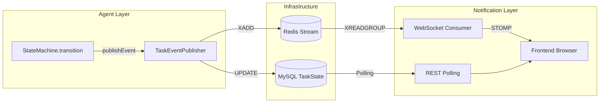

# J-AP (J-Architect-Pilot) 2026 — 方案设计文档 (Architecture)

> **文档版本**: v1.0.0  
> **阶段**: 第二阶段 — 逻辑降维 (Architecture Design)  
> **日期**: 2026-04-04  
> **前置**: [1_PRD.md](./1_PRD.md) ✅ 已评审通过  
> **状态**: 待实施

---

## 0. 审计响应：Maven 构建隔离性增强

> PRD 审计指出：生成的代码可能通过**反射或字节码注入逃逸沙盒**。本架构文档在 §3.2 ProcessSandbox 中对此做了专项增强设计。

### 攻击向量与防御矩阵

| 攻击向量 | 危害等级 | 防御措施 | 所在章节 |
|---------|---------|---------|---------|
| `Runtime.exec()` / `ProcessBuilder` 调用 | 🔴 CRITICAL | AST 静态扫描 + SecurityManager 策略 + JVM 参数白名单 | §3.2 |
| 反射调用 `Class.forName` 加载恶意类 | 🟠 HIGH | ClassLoader 隔离 (IsolatedClassLoader) + `--add-opens` 白名单 | §3.3 |
| ASM/ByteBuddy 字节码注入修改 J-AP 类 | 🔴 CRITICAL | 禁止 bytebuddy/asm 依赖 + 字节码检查器 | §3.3 |
| 通过符号链接 (symlink) 绕过路径校验 | 🟠 HIGH | `Path.toRealPath(NOFOLLOW_LINKS)` + 符号链接检测 | §4 CodeFileSystemTools |
| MAVEN_OPTS 注入任意 JVM 参数 | 🔴 CRITICAL | MavenExecutor 固定安全参数，忽略外部 MAVEN_OPTS | §3.2 |
| 子进程 fork-bomb / 资源耗尽 | 🟠 HIGH | 进程树监控 + cgroup/Job Object 限制 | §3.2 |

---

## 1. 模块化设计 (Package Structure)

严格遵循 PRD §4.1 定义的 Jakarta EE 11 包结构。所有包名使用 `com.jap.*`。

### 1.1 模块依赖图

```
                    ┌─────────────────┐
                    │   com.jap.api    │  ← REST 入口层
                    │  (Controller)    │
                    └────────┬────────┘
                             │ depends on
              ┌──────────────┼──────────────┐
              ▼              ▼              ▼
     ┌────────────────┐ ┌──────────┐ ┌──────────────┐
     │ com.jap.core   │ │com.jap.llm│ │ com.jap.build │
     │  (引擎核心)     │ │(LLM 抽象)│ │  (构建执行)   │
     └───────┬────────┘ └────┬─────┘ └──────┬───────┘
             │ depends on       │ depends on     │ depends on
             ▼                  ▼                ▼
     ┌────────────────┐ ┌──────────────┐ ┌──────────────────┐
     │ com.jap.healing│ │ com.jap.gen  │ │ com.jap.validator│
     │  (自修复引擎)   │ │ (代码生成器) │ │   (多层校验器)   │
     └───────┬────────┘ └──────┬───────┘ └────────┬─────────┘
             │ depends on        │ depends on         │ depends on
             ▼                   ▼                    ▼
     ┌──────────────────────────────────────────────────────────┐
     │                     com.jap.sandbox                       │
     │                      (安全沙盒)                            │
     └───────────────────────────┬──────────────────────────────┘
                                 │ depends on
                                 ▼
     ┌──────────────────────────────────────────────────────────┐
     │                   Infrastructure Layer                     │
     │  Spring Boot 3.4.x │ LangChain4j 1.0.0 │ MySQL 9.x │ Redis 7.4+ │
     └──────────────────────────────────────────────────────────┘
```

**依赖规则**:
- 上层模块可以依赖下层，下层**禁止反向依赖**上层
- `com.jap.core` 是编排层，不包含业务逻辑实现
- `com.jap.healing` 和 `com.jap.sandbox` 是平级的基础设施模块，互不依赖
- 所有跨模块通信通过**接口契约**（Java Interface），具体实现由 Spring IoC 注入

### 1.2 完整包结构

```
com.jap/
├── JapApplication.java                          # Spring Boot 启动类
│
├── config/
│   ├── JapProperties.java                       # @ConfigurationProperties
│   ├── LlmConfiguration.java                    # LangChain4j ChatModel Bean
│   ├── RedisConfiguration.java                  # Redis + RedisJSON + RediSearch
│   ├── SandboxConfiguration.java                # 沙盒根路径初始化
│   ├── VirtualThreadConfiguration.java          # 虚拟线程 Executor 配置
│   ├── JpaConfiguration.java                    # MySQL/H2 Datasource
│   └── WebSocketConfiguration.java              # STOMP Endpoint
│
├── api/
│   ├── JapController.java                       # POST /api/v1/tasks
│   ├── TaskStatusController.java                # GET /api/v1/tasks/{id}/status
│   ├── dto/
│   │   ├── SubmitRequest.java                   # @Valid 提交请求 DTO
│   │   ├── TaskStatusResponse.java              # 任务状态响应 DTO
│   │   ├── ErrorResponse.java                   # 错误响应 DTO
│   │   └── record TimelineEvent.java            # 时间线事件 Record
│   └── exception/
│       ├── GlobalExceptionHandler.java          # @RestControllerAdvice
│       ├── ApiException.java                    # 自定义异常基类
│       ├── SandboxViolationException.java       # E05 安全违规
│       └── HealingExhaustedException.java       # 重试耗尽
│
├── core/
│   ├── agent/
│   │   ├── JapAgent.java                        # Agent 主控类 (单任务生命周期)
│   │   ├── AgentOrchestrator.java               # 多 Agent 编排器 (虚拟线程池)
│   │   ├── AgentContext.java                    # Agent 执行上下文 (@Scope("prototype"))
│   │   └── AgentResult.java                     # Agent 执行结果 (不可变)
│   ├── intent/
│   │   ├── IntentAnalyzer.java                  # 意图分析入口
│   │   ├── RequirementSpec.java                 # 需求规格模型 (@Value)
│   │   ├── ModuleSpec.java                      # 模块规格模型 (@Builder)
│   │   ├── EndpointSpec.java                    # API 端点规格
│   │   └── DependencySpec.java                  # 依赖规格
│   ├── pipeline/
│   │   ├── AgentPipeline.java                   # Pipeline 编排器 (策略链)
│   │   ├── PipelineStage.java                   # 阶段枚举 (sealed interface)
│   │   ├── StageHandler.java                    # 阶段处理器接口
│   │   ├── handler/
│   │   │   ├── AnalysisStageHandler.java        # INTENT_ANALYSIS 处理
│   │   │   ├── GenerationStageHandler.java      # CODE_GENERATION 处理
│   │   │   ├── BuildTestStageHandler.java       # BUILD_TEST 处理
│   │   │   └── BugFixStageHandler.java          # BUG_FIX 处理
│   │   └── PipelineResult.java                  # 阶段执行结果
│   └── state/
│       ├── AgentStateMachine.java               # 状态机核心 (per-task)
│       ├── AgentStatus.java                     # 状态枚举
│       ├── Transition.java                      # 状态转换事件 (sealed)
│       ├── TransitionResult.java               # 转换结果
│       ├── StateChangeListener.java            # 状态变更监听器
│       └── TaskStateRepository.java            # JPA Repository
│
├── llm/
│   ├── output/
│   │   ├── StructuredOutputParser.java          # JSON Schema 强约束解析
│   │   ├── OutputValidator.java                 # 输出校验接口
│   │   ├── RequirementSpecValidator.java        # RequirementSpec 校验实现
│   │   └── JsonSchemaProvider.java             # Schema 提供 (按阶段)
│   ├── tool/
│   │   ├── CodeFileSystemTools.java            # ★ 文件系统操作工具 (@Tool)
│   │   ├── MavenExecutionTool.java             # Maven 执行工具 (@Tool)
│   │   ├── CodeReadTool.java                   # 代码读取工具 (@Tool)
│   │   └── CodeWriteTool.java                  # 代码写入工具 (@Tool)
│   ├── memory/
│   │   ├── AgentMemory.java                    # 记忆接口
│   │   ├── RedisAgentMemory.java               # Redis 实现
│   │   ├── ConversationMessage.java            # 对话消息模型
│   │   └── MemorySearchService.java            # Vector Search 服务
│   └── service/
│       ├── AnalysisAiService.java              # AiServices 声明式 (分析)
│       ├── GenerationAiService.java            # AiServices 声明式 (生成)
│       ├── FixAiService.java                   # AiServices 声明式 (修复)
│       └── prompt/
│           ├── SystemPromptTemplate.java       # System Prompt 模板引擎
│           ├── AnalysisSystemPrompt.java       # 分析阶段 system prompt
│           ├── GenerationSystemPrompt.java     # 生成阶段 system prompt
│           └── FixSystemPrompt.java            # 修复阶段 system prompt
│
├── generator/
│   ├── JavaSourceGenerator.java                # Java 源码生成入口
│   ├── PomGenerator.java                       # POM 文件生成
│   ├── TestCodeGenerator.java                  # 测试代码生成
│   ├── ConfigGenerator.java                    # application.yml 生成
│   ├── template/
│   │   ├── EntityTemplate.java                 # JPA Entity 模板
│   │   ├── RepositoryTemplate.java             # Repository 模板
│   │   ├── ServiceTemplate.java                # Service 模板
│   │   ├── ControllerTemplate.java             # Controller 模板
│   │   ├── DtoTemplate.java                    # DTO 模板
│   │   └── TestTemplate.java                   # JUnit5 Test 模板
│   └── model/
│       ├── GeneratedFile.java                  # 生成文件描述
│       └── GeneratedModule.java                # 生成模块描述
│
├── validator/
│   ├── AstValidator.java                       # AST 静态分析 (JavaParser)
│   ├── SemanticValidator.java                  # 语义事实校验
│   ├── SecurityValidator.java                  # 安全扫描器
│   ├── NamingConventionValidator.java          # 命名校验
│   ├── JakartaEEComplianceChecker.java         # Jakarta EE 11 合规
│   ├── model/
│   │   ├── ValidationResult.java              # 校验结果
│   │   ├── Violation.java                      # 违规记录
│   │   └── ViolationSeverity.java             # 违规严重程度
│   └── rule/
│       ├── NoJavaxImportRule.java              # 禁止 javax.* 导入
│       ├── NamingConventionRule.java           # 命名约定规则
│       ├── SandboxPathRule.java                # 沙盒路径规则
│       └── ForbiddenApiRule.java               # 禁止 API 规则
│
├── build/
│   ├── MavenExecutor.java                      # Maven 进程执行器
│   ├── BuildResult.java                        # 构建结果模型
│   ├── ErrorParser.java                        # 错误解析器 (正则)
│   ├── TestReportParser.java                   # Surefire XML 解析
│   ├── CompilerError.java                      # 编译错误模型
│   ├── TestFailure.java                        # 测试失败模型
│   └── model/
│       ├── BuildSuccess.java                   # 构建成功结果
│       ├── BuildFailure.java                   # 构建失败结果
│       └── BuildTimeout.java                   # 构建超时结果
│
├── healing/                                    # ★ 自修复引擎 (重点模块)
│   ├── HealingEngine.java                      # 自修复门面 (Spring Bean)
│   ├── ErrorClassifier.java                    # 错误分类器接口
│   ├── impl/
│   │   ├── MavenCompileErrorClassifier.java    # E02 分类
│   │   ├── JUnitTestFailureClassifier.java     # E06 分类
│   │   ├── SecurityViolationClassifier.java    # E05 分类
│   │   ├── OutputParseErrorClassifier.java     # E01 分类
│   │   ├── ComplianceErrorClassifier.java      # E03 分类
│   │   ├── HallucinationClassifier.java        # E04 分类
│   │   └── DesignDefectClassifier.java         # E07 分类
│   ├── ContextCollector.java                   # 上下文收集器
│   ├── FixPromptGenerator.java                 # 修复提示生成器
│   ├── PatchApplier.java                       # 补丁应用器
│   ├── DiffParser.java                         # Unified Diff 解析
│   ├── RetryController.java                    # 重试控制器
│   ├── RetryPolicy.java                        # 重试策略 (按错误类型)
│   ├── HealingRecordService.java              # 修复记录持久化
│   └── model/
│       ├── ClassifiedError.java               # 分类后的错误
│       ├── ErrorContext.java                   # 错误上下文
│       ├── FixPrompt.java                      # 修复提示
│       ├── FixResult.java                      # 修复结果
│       └── HealingRound.java                  # 修复轮次
│
├── sandbox/                                    # ★ 安全沙盒 (重点模块)
│   ├── SandboxManager.java                     # 沙盒管理器 (门面)
│   ├── filesystem/
│   │   ├── FileSystemSandbox.java             # 文件系统沙盒接口
│   │   ├── DefaultFileSystemSandbox.java       # 默认实现
│   │   ├── PathValidator.java                 # ★ 路径校验器 (核心契约)
│   │   ├── SandboxFileOperation.java          # 文件操作接口
│   │   └── SandboxPathResolver.java           # 路径解析器
│   ├── process/
│   │   ├── ProcessSandbox.java                # 进程沙盒接口
│   │   ├── SecureMavenExecutor.java           # ★ 安全 Maven 执行器
│   │   ├── SecurityPolicy.java               # 安全策略定义
│   │   ├── ProcessMonitor.java               # 进程监控器
│   │   └── ProcessTreeKiller.java            # 进程树杀灭器
│   ├── classloader/
│   │   ├── ClassLoaderSandbox.java            # ClassLoader 沙盒接口
│   │   ├── IsolatedClassLoader.java          # 隔离 ClassLoader
│   │   └── BytecodeInspector.java            # 字节码检查器
│   └── model/
│       ├── SandboxViolation.java              # 沙盒违规记录
│       ├── SandboxOperation.java             # 操作类型枚举
│       └── SecurityLevel.java                # 安全级别
│
└── event/
    ├── TaskEventPublisher.java                # 任务事件发布器
    ├── TaskEventListener.java                 # 任务事件监听器
    └── model/
        └── TaskEvent.java                     # 任务事件模型
```

---

## 2. 核心时序图：双闭环

### 2.1 双闭环概念定义

```
┌─────────────────────────────────────────────────────────────────┐
│                                                                 │
│   ╔═══════════════════════════════════════════════════════╗     │
│   ║              外环: Self-Healing Loop (构建修复)          ║     │
│   ║                                                          ║     │
│   ║   CODE_GENERATION → BUILD_TEST → [失败?] → BUG_FIX ──┐  ║     │
│   ║         ↑                                      │      │  ║     │
│   ║         └──────────────────────────────────────────┘      ║     │
│   ║                                                          ║     │
│   ╠═══════════════════════════════════════════════════════╣     │
│   ║              内环: Self-Correction Loop (输出纠错)       ║     │
│   ║                                                          ║     │
│   ║   LLM 调用 → OutputParser → [格式错误?] → 重试 LLM ──┐ ║     │
│   ║              ↑                                  │      │ ║     │
│   ║              └──────────────────────────────────┘      ║     │
│   ║                                                          ║     │
│   ╚═══════════════════════════════════════════════════════╝     │
│                                                                 │
└─────────────────────────────────────────────────────────────────┘
```

| 维度 | 内环 (Self-Correction) | 外环 (Self-Healing) |
|------|------------------------|---------------------|
| **触发条件** | LLM 输出格式错误 (E01) | 构建/测试失败 (E02-E07) |
| **处理范围** | OutputParser 层面 | 跨代码生成+构建测试 |
| **延迟** | 毫秒级 (~100ms-1s) | 秒级 (~10s-120s) |
| **重试次数** | 1-2 次 | 2-3 次 |
| **副作用** | 无（纯内存操作） | 有（修改文件系统） |
| **参与组件** | AiService + OutputParser | HealingEngine + MavenExecutor + FixAiService |

### 2.2 完整双闭环时序图

```mermaid
sequenceDiagram
    participant User as 用户
    participant API as JapController
    participant Orch as AgentOrchestrator
    participant Agent as JapAgent (+StateMachine)
    participant Pipe as AgentPipeline
    participant Analysis as AnalysisStageHandler
    participant Gen as GenerationStageHandler
    participant Validator as Multi-Layer Validator
    participant Build as BuildTestStageHandler
    participant Maven as SecureMavenExecutor
    participant Heal as HealingEngine
    participant Classifier as ErrorClassifier
    Collector as ContextCollector
    GenFix as FixPromptGenerator
    FixLLM as FixAiService
    Patcher as PatchApplier
    participant LLM as LangChain4j LLM
    participant Parser as StructuredOutputParser
    participant FS as CodeFileSystemTools
    participant Redis as Redis (记忆+事件)

    User->>API: POST /api/v1/tasks {requirement}
    API->>Orch: submitTask(request)
    
    Note over Orch: 创建虚拟线程运行 Agent
    
    par 虚拟线程启动 (每个Task独立VT)
        Orch->>Agent: run(agentContext)
        
        Note over Agent: StateMachine: IDLE → INTENT_ANALYSIS
        
        %% ========== 阶段1: INTENT_ANALYSIS ==========
        Agent->>Pipe: executeStage(INTENT_ANALYSIS)
        Pipe->>Analysis: handle(context)
        
        loop 内环: Self-Correction (E01 格式纠错)
            Analysis->>LLM: analyzeRequirement(requirement)<br/>[带 JSON Schema]
            LLM-->>Parser: 原始输出
            
            alt 输出格式正确
                Parser-->>Analysis: RequirementSpec parsed ✅
            else E01: 格式错误
                Parser-->>Analysis: JsonParsingException
                Analysis->>LLM: retry with schema hint<br/>[retryCount++]
                Note over Parser: 最多重试 2 次
            end
        end
        
        Analysis-->>Pipe: StageResult(spec, SUCCESS)
        Pipe->>Agent: stageComplete
        
        Note over Agent: StateMachine: INTENT_ANALYSIS → CODE_GENERATION
        
        %% ========== 阶段2: CODE_GENERATION ==========
        Agent->>Pipe: executeStage(CODE_GENERATION)
        Pipe->>Gen: handle(spec)
        
        Gen->>LLM: generateCode(spec)
        LLM-->>Gen: codeOutput (多文件内容)
        
        par 多模块并行生成 (虚拟线程)
            Gen->>FS: writeFile("entity/User.java", content)
            FS->>FS: PathValidator.validate(path)
            FS->>FS: sandboxRoot.resolve(normalizedPath)
            FS->>FS: prefixCheck(resolvedPath)
            FS-->>Gen: write success ✅
            
            Gen->>FS: writeFile("repository/UserRepo.java", content)
            FS-->>Gen: write success ✅
        end
        
        Gen->>Validator: validateAll(generatedFiles)
        
        alt Layer1: AST 校验
            Validator-->>Gen: VIOLATION(E03: javax.* import)
            Gen->>LLM: regenerate with fix hint
            LLM-->>Gen: fixed code
            Validator-->>Gen: PASSED ✅
        else Layer2: 安全校验
            Validator-->>Gen: VIOLATION(E05: path traversal)
            Note over Validator: CRITICAL! 不计入普通重试
            Gen->>LLM: urgent security fix required
            LLM-->>Gen: safe code
            Validator-->>Gen: SECURITY_PASSED ✅
        end
        
        Gen->>Redis: saveGeneratedFiles(taskId, fileSet)
        Gen-->>Pipe: StageResult(files, SUCCESS)
        Pipe->>Agent: stageComplete
        
        Note over Agent: StateMachine: CODE_GENERATION → BUILD_TEST
        
        %% ========== 阶段3: BUILD_TEST ==========
        Agent->>Pipe: executeStage(BUILD_TEST)
        Pipe->>Build: handle(generatedProject)
        Build->>Maven: executeBuild(projectDir)
        
        Note over Maven: ProcessSandbox 生效:<br/>• 固定 JVM 安全参数<br/>• -Xmx512m 限制<br/>• 120s 超时<br/>• 网络白名单<br/>• 禁止 MAVEN_OPTS 注入
        
        alt 构建成功 + 测试全绿
            Maven-->>Build: BuildResult(SUCCESS)
            Build-->>Pipe: StageResult(SUCCESS)
            Pipe->>Agent: stageComplete
            
            Note over Agent: StateMachine: BUILD_TEST → COMPLETE
            Agent->>Redis: publishEvent(COMPLETED)
            Agent-->>Orch: AgentResult(COMPLETE)
            
        else E02: 编译失败 或 E06: 测试失败
            Maven-->>Build: BuildResult(FAILURE, errorOutput)
            Build-->>Pipe: StageResult(FAILURE, errors)
            Pipe->>Agent: stageFailed(errorList)
            
            Note over Agent: StateMachine: BUILD_TEST → BUG_FIX
            
            %% ========== 阶段4: BUG_FIX (外环自修复) ==========
            Agent->>Pipe: executeStage(BUG_FIX)
            Pipe->>Heal: heal(errors, context)
            
            loop 外环: Self-Healing (最多3轮)
                
                Heal->>Classifier: classify(rawErrors)
                Classifier-->>Heal: List<ClassifiedError><br/>[E02/E06 + file/line/details]
                
                Heal->>Collector: collectContext(classifiedErrors)
                Collector->>FS: readFile(errorFile)
                FS-->>Collector: sourceContent
                Collector->>Redis: searchSimilarFixes(errorSignature)
                Redis-->>Collector: historicalFixes (Vector Search)
                Collector-->>Heal: ErrorContext(source, history, spec)
                
                Heal->>GenFix: generateFixPrompt(errorCtx)
                GenFix-->>Heal: FixPrompt(structured)
                
                Heal->>FixLLM: fixCode(fixPrompt)
                FixLLM->>LLM: 发送修复指令<br/>[temperature=0.1]
                LLM-->>FixLLM: fixResponse (diff or full code)
                FixLLM-->>Heal: FixResult(fixedCode)
                
                Heal->>Patcher: applyPatch(fixedCode)
                Patcher->>FS: writeFile(file, patchedContent)
                FS-->>Patcher: applied ✅
                Patcher-->>Heal: PatchResult(applied)
                
                Heal->>Redis: saveHealingRecord(round)
                
                Heal->>Maven: executeBuild(projectDir) — 重新构建
                
                alt 重新构建成功
                    Maven-->>Heal: BuildResult(SUCCESS)
                    Heal--->>Pipe: StageResult(SUCCESS) — 退出循环
                    Pipe->>Agent: stageComplete
                    Note over Agent: StateMachine: BUG_FIX → COMPLETE
                else 仍然失败 & retryCount < maxRetries
                    Maven-->>Heal: BuildResult(FAILURE, newErrors)
                    Note over Heal: retryCount++, 指数退避
                else retryCount >= maxRetries (3次)
                    Maven-->>Heal: BuildResult(FAILURE)
                    Heal--->>Pipe: StageResult(EXHAUSTED)
                    Pipe->>Agent: healingExhausted
                    Note over Agent: StateMachine: BUG_FIX → MANUAL_INTERVENTION
                    Agent->>Redis: saveFullContextForHuman()
                end
            end
        end
    end
    
    Redis-->>User: WS 推送实时事件流
    API-->>User: 202 Accepted {taskId, statusUrl}
```

### 2.3 内环详细时序 (Self-Correction — E01 处理)

```mermaid
sequenceDiagram
    participant Handler as AnalysisStageHandler
    participant AI as AnalysisAiService
    participant LLM as LangChain4j ChatModel
    participant Parser as StructuredOutputParser
    participant Schema as JsonSchemaProvider
    participant Val as RequirementSpecValidator

    Handler->>AI: analyze(requirement)
    AI->>Schema: getSchemaFor(RequirementSpec.class)
    Schema-->>AI: JSON Schema 定义
    
    AI->>LLM: chat(prompt + schema constraint)
    
    Note over LLM: 第1次调用
    
    LLM-->>AI: rawResponse (畸形 JSON)
    
    AI->>Parser: parse(rawResponse, schema)
    
    alt 格式完全正确
        Parser-->>AI: RequirementSpec instance ✅
        AI->>Val: validate(spec)
        Val-->>AI: ValidationResult(PASSED)
        AI-->>Handler: RequirementSpec ✅
    else E01a: JSON 语法错误
        Parser-->>AI: JsonParseException
        Note over AI: retryCount = 0/2
        AI->>LLM: retry with correctionHint<br/>"JSON syntax error at line N"
        LLM-->>AI: rawResponse2
        AI->>Parser: parse(rawResponse2, schema)
        Parser-->>AI: RequirementSpec instance ✅ (第2次成功)
        AI--->Handler: RequirementSpec ✅
    else E01b: 缺少必需字段
        Parser-->>AI: MissingFieldException(fields=[modules, dependencies])
        Note over AI: retryCount = 0/2
        AI->>LLM: retry with fieldRequirements<br/>"必须包含: modules[], dependencies[]"
        LLM-->>AI: rawResponse2
        Parser-->>AI: RequirementSpec ✅
    else E01c: 类型不匹配
        Parser-->>AI: TypeMismatchException(field="maxRetries", expected=INT, got=STRING)
        AI->>LLM: retry with typeHints
        Parser--->AI: RequirementSpec ✅
    else E01d: 连续2次失败
        Parser-->>AI: JsonParseException (retryCount=2)
        AI-->>Handler: throw OutputValidationException(E01_EXHAUSTED)
        Note over Handler: 降级到 MANUAL_INTERVENTION
    end
```

### 2.4 外环详细时序 (Self-Healing — E02/E06 处理)

```mermaid
sequenceDiagram
    participant Heal as HealingEngine
    participant Cls as ErrorClassifier
    participant Ctx as ContextCollector
    participant FPG as FixPromptGenerator
    participant FixAI as FixAiService
    participant LLM as LangChatModel (fix mode)
    participant Patcher as PatchApplier
    participant Maven as SecureMavenExecutor
    participant Retry as RetryController
    participant DB as HealingRecordService

    Heal->>Cls: classify(buildErrors)
    
    Note over Cls: 错误分类流水线
    
    Cls->>Cls: 正则匹配 error pattern
    Cls->>Cls: 映射到 ErrorCategory (E01~E07)
    Cls->>Cls: 提取结构化字段 (file, line, symbol, message)
    Cls->>Cls: 评估 severity (NORMAL / CRITICAL)
    Cls-->>Heal: List<ClassifiedError>
    
    Heal->>Retry: checkRemainingRetries(errorCategory)
    Retry-->>Heal: RetryDecision(ALLOWED, remaining=2)
    
    Heal->>Ctx: collect(classifiedErrors)
    
    Note over Ctx: 上下文收集 (并行)
    
    par 并行上下文收集
        Ctx->>Ctx: 读取错误文件源码 (±10行窗口)
        Ctx->>Ctx: 解析相关类的 public API 签名
        Ctx->>Ctx: 从 Redis Vector Search 检索历史相似修复
        Ctx->>Ctx: 获取原始 RequirementSpec
    end
    
    Ctx--->Heal: ErrorContext(complete)
    
    Heal->>FPG: generateFixPrompt(errorContext)
    
    Note over FPG: 按 errorCategory 选择模板
    
    FPG->>FPG: loadTemplate(error.category) — E02/E06 不同模板
    FPG->>FPG: fillPlaceholders(error, context.source, context.history)
    FPG->>FPG: appendConstraints(jakartaEE11, namingRules, noRefactor)
    FPG--->Heal: FixPrompt(ready)
    
    Heal->>FixAI: generateFix(fixPrompt)
    
    Note over FixAI: temperature=0.1 (最低创造性)
    
    FixAI->>LLM: system="你是Java修复专家" user=fixPrompt.content
    LLM-->>FixAI: fixResponse
    
    alt LLM 返回 diff 格式
        FixAI--->Heal: FixResult(diffFormat, patchContent)
    else LLM 返回完整文件
        FixAI--->Heal: FixResult(fullFile, newContent)
    else LLM 返回解释无代码
        FixAI--->Heal: FixResult(REJECTION, reason)
        Note over Heal: 记录为 failed round, 不应用补丁
    end
    
    Heal->>Patcher: apply(fixResult)
    
    Patcher->>Patcher: parseDiffOrFullFile(fixResult)
    Patcher->>Patcher: validatePatchSafety(无越权操作)
    Patcher->>Patcher: writeToSandbox(targetFile, newContent)
    Patcher--->Heal: PatchResult(applied=true, filesModified=[...])
    
    Heal->>DB: saveHealingRecord(round, classifiedError, fixPrompt, fixResult)
    
    Heal->>Maven: rebuild(projectDir)
    
    alt 构建成功
        Maven--->Heal: BuildResult(SUCCESS)
        Heal--->Heal: return HealingOutcome(HEALED, totalRounds=N)
    else 构建仍然失败
        Maven--->Heal: BuildResult(FAILURE, newErrors)
        Heal->>Retry: recordFailure(increment)
        Retry--->Heal: RetryDecision(RETRY, nextDelayMs=2000)
        Note over Heal: 指数退避等待后进入下一轮
    end
    
    Note over Heal: 最大3轮后 → HealingOutcome(EXHAUSTED)
```

---

## 3. 核心接口定义

### 3.1 com.jap.healing — 自修复引擎

#### 3.1.1 HealingEngine (门面)

```java
package com.jap.healing;

public interface HealingEngine {

    /**
     * 执行完整的自修复流程。
     *
     * @param buildResult 失败的构建结果
     * @param agentContext 当前 Agent 执行上下文
     * @return 修复结果：HEALED（成功）或 EXHAUSTED（需人工介入）
     */
    HealingOutcome heal(BuildResult buildResult, AgentContext agentContext);

    /**
     * 取消正在进行的修复过程。
     */
    void cancel(String taskId);
}
```

#### 3.1.2 ErrorClassifier (错误分类器)

```java
package com.jap.healing;

public interface ErrorClassifier {

    ClassifiedError classify(BuildFailure failure);

    List<ClassifiedError> classifyAll(List<BuildFailure> failures);
}

@Value
@Builder
public class ClassifiedError {
    ErrorCategory category;        // E01 ~ E07
    String errorCode;              // 具体错误标识
    String file;                   // 出错文件相对路径
    Integer line;                  // 出错行号 (可为 null)
    String details;                // 错误详情
    String suggestion;             // 建议 (来自编译器/测试框架)
    Severity severity;             // NORMAL / CRITICAL
    Map<String, Object> metadata;  // 扩展元数据
}

public enum ErrorCategory {
    FORMAT_ERROR("E01", "结构化输出格式错误"),
    COMPILE_ERROR("E02", "编译错误"),
    COMPLIANCE_ERROR("E03", "规范违规"),
    HALLUCINATION("E04", "幻觉内容"),
    SECURITY_VIOLATION("E05", "安全域越权"),
    TEST_FAILURE("E06", "测试失败"),
    DESIGN_DEFECT("E07", "设计缺陷");

    private final String code;
    private final String description;
}
```

#### 3.1.3 ContextCollector (上下文收集器)

```java
package com.jap.healing;

public interface ContextCollector {

    /**
     * 收集修复所需的全量上下文。使用 JDK 25 StructuredConcurrency 并行收集。
     */
    ErrorContext collect(ClassifiedError error, AgentContext agentContext);
}

@Value
@Builder
public class ErrorContext {
    ClassifiedError error;
    SourceWindow faultySource;          // 出错代码 ±10 行窗口
    List<ApiSignature> availableApis;   // 相关类的可用 API
    List<HistoricalFix> similarFixes;   // 向量检索到的历史相似修复
    RequirementSpec requirementSpec;    // 原始需求规格
    List<HealingRound> pastRounds;      // 本任务之前的修复轮次 (去重用)
}

@Value
@Builder
public class SourceWindow {
    String filePath;
    int startLine;
    int endLine;
    String content;                     // 原始源码片段
    int errorLineOffset;                // 错误行在 snippet 中的偏移
}
```

#### 3.1.4 FixPromptGenerator (修复提示生成器)

```java
package com.jap.healing;

public interface FixPromptGenerator {

    FixPrompt generate(ErrorContext context);
}

@Value
@Builder
public class FixPrompt {
    String systemInstruction;           // 系统指令部分
    String errorReport;                 // 结构化错误报告 (JSON)
    String faultyCode;                  // 出错代码片段
    String availableApis;               // 可用 API 参考
    String historicalReference;         // 历史修复参考 (可选)
    String constraints;                 // 约束条件列表
    String expectedOutput;              // 期望输出格式说明
}
```

#### 3.1.5 PatchApplier (补丁应用器)

```java
package com.jap.healing;

public interface PatchApplier {

    /**
     * 应用 LLM 返回的修复补丁。
     *
     * @return 补丁应用结果，包含被修改的文件列表
     * @throws SandboxViolationException 如果修复内容试图越权
     */
    PatchResult apply(FixResult fixResult, Path workspaceRoot) throws SandboxViolationException;
}

@Value
@Builder
public class PatchResult {
    boolean applied;
    List<PatchedFile> modifiedFiles;
    String revertInstructions;          // 回滚指引 (如果需要)
}

@Value
public class PatchedFile {
    Path relativePath;
    PatchType type;                     // FULL_REPLACE / DIFF_PATCH / CREATE
    String digestBefore;                // 修改前 SHA-256 (用于回滚)
    String digestAfter;                 // 修改后 SHA-256
}
```

#### 3.1.6 RetryController (重试控制器)

```java
package com.jap.healing;

public interface RetryController {

    RetryDecision canRetry(ErrorCategory category, int currentRetryCount);

    void recordAttempt(String taskId, ErrorCategory category);

    Duration getNextBackoff(ErrorCategory category, int attemptNumber);
}

@Value
@Builder
public class RetryDecision {
    boolean allowed;
    int remainingAttempts;
    Duration backoffDuration;
    String reason;
}
```

#### 3.1.7 默认重试策略配置

```java
package com.jap.healing;

@Component
public class DefaultRetryPolicy implements RetryPolicy {

    private static final Map<ErrorCategory, RetryConfig> CONFIG = Map.of(
        ErrorCategory.FORMAT_ERROR,       new RetryConfig(2, Duration.ofSeconds(1), false),
        ErrorCategory.COMPILE_ERROR,      new RetryConfig(3, Duration.ofSeconds(1), true),
        ErrorCategory.COMPLIANCE_ERROR,   new RetryConfig(2, Duration.ofSeconds(1), false),
        ErrorCategory.HALLUCINATION,      new RetryConfig(2, Duration.ofSeconds(1), false),
        ErrorCategory.SECURITY_VIOLATION, new RetryConfig(2, Duration.ofSeconds(1), false),
        ErrorCategory.TEST_FAILURE,       new RetryConfig(3, Duration.ofSeconds(1), true),
        ErrorCategory.DESIGN_DEFECT,      new RetryConfig(2, Duration.ofSeconds(1), false)
    );

    @Override
    public RetryConfig getConfig(ErrorCategory category) {
        return CONFIG.getOrDefault(category, new RetryConfig(2, Duration.ofSeconds(1), false));
    }

    @Override
    public Duration calculateBackoff(RetryConfig config, int attempt) {
        if (!config.exponentialBackoff()) {
            return config.baseDelay();
        }
        return config.baseDelay().multipliedBy((long) Math.pow(2, attempt - 1));
    }
}

@Value
public record RetryConfig(
    int maxRetries,
    Duration baseDelay,
    boolean exponentialBackoff
) {}
```

---

### 3.2 com.jap.sandbox — 安全沙盒

#### 3.2.1 SandboxManager (门面)

```java
package com.jap.sandbox;

public interface SandboxManager {

    FileSystemSandbox fileSystem();

    ProcessSandbox process();

    ClassLoaderSandbox classLoader();

    Path getRoot();
}
```

#### 3.2.2 PathValidator (★ 路径校验器 — 核心契约)

```java
package com.jap.sandbox.filesystem;

/**
 * 路径校验器 — 沙盒安全的最后一道防线。
 * 
 * 所有经过此校验器的路径保证：
 * 1. 已标准化 (normalize) — 解析 "." 和 ".."
 * 2. 已绝对化 (toAbsolutePath) — 消除相对路径歧义
 * 3. 符号链接已解析 (toRealPath NOFOLLOW_LINKS) — 防止 symlink 逃逸
 * 4. 前缀匹配 — 必须以 sandboxRoot 为前缀
 */
public interface PathValidator {

    /**
     * 校验并解析用户输入的相对路径为安全的绝对路径。
     *
     * @param relativePath 用户输入的相对路径 (如 "src/main/java/App.java")
     * @return 经过安全校验的绝对路径 (一定在 sandboxRoot 下)
     * @throws SandboxViolationException 路径穿越、超出沙盒等安全违规
     */
    Path validateAndResolve(String relativePath) throws SandboxViolationException;

    /**
     * 校验一个已经解析的绝对路径是否合法。
     */
    void validateAbsolute(Path absolutePath) throws SandboxViolationException;

    /**
     * 检测路径穿越攻击模式。
     */
    boolean isTraversalAttempt(String pathInput);
}

@Component
public class DefaultPathValidator implements PathValidator {

    private final Path sandboxRoot;

    public DefaultPathValidator(@Value("${jap.sandbox.base-dir:generated-workspace}") String baseDir) {
        this.sandboxRoot = Paths.get(baseDir).toAbsolutePath().normalize();
    }

    @Override
    public Path validateAndResolve(String relativePath) throws SandboxViolationException {
        Objects.requireNonNull(relativePath, "relativePath must not be null");
        
        if (isTraversalAttempt(relativePath)) {
            throw new SandboxViolationException(
                SandboxOperation.READ,
                "Path traversal detected: " + relativePath,
                SecurityLevel.CRITICAL
            );
        }

        Path normalized;
        try {
            normalized = Paths.get(relativePath).normalize();
        } catch (InvalidPathException e) {
            throw new SandboxViolationException(
                SandboxOperation.READ, "Invalid path: " + relativePath, SecurityLevel.HIGH
            );
        }

        Path absolute = sandboxRoot.resolve(normalized).normalize();

        Path realPath;
        try {
            realPath = absolute.toRealPath(LinkOption.NOFOLLOW_LINKS);
        } catch (IOException e) {
            if (!absolute.startsWith(sandboxRoot)) {
                throw new SandboxViolationException(
                    SandboxOperation.READ,
                    "Path escapes sandbox root: " + absolute,
                    SecurityLevel.CRITICAL
                );
            }
            return absolute;
        }

        if (!realPath.startsWith(sandboxRoot)) {
            throw new SandboxViolationException(
                SandboxOperation.READ,
                "Resolved path escapes sandbox (symlink attack): " + realPath + " -> outside " + sandboxRoot,
                SecurityLevel.CRITICAL
            );
        }

        return realPath;
    }

    @Override
    public void validateAbsolute(Path absolutePath) throws SandboxViolationException {
        Path normalized = absolutePath.normalize().toAbsolutePath();
        if (!normalized.startsWith(sandboxRoot)) {
            throw new SandboxViolationException(
                SandboxOperation.UNKNOWN,
                "Absolute path outside sandbox: " + normalized,
                SecurityLevel.CRITICAL
            );
        }
    }

    @Override
    public boolean isTraversalAttempt(String pathInput) {
        if (pathInput == null || pathInput.isBlank()) return true;
        String normalized = pathInput.replace('\\', '/');
        return normalized.contains("..")
            || normalized.startsWith("/")
            || normalized.contains("//")
            || Pattern.compile("[\\x00-\\x1f]").matcher(normalized).find();
    }
}
```

#### 3.2.3 CodeFileSystemTools (★ LangChain4j Tool Calling 契约)

```java
package com.jap.llm.tool;

import com.jap.sandbox.SandboxViolationException;

/**
 * LangChain4j @Tool 接口 — LLM 通过 Tool Calling 操作生成工作区的文件系统。
 * 
 * 安全保障：
 * 1. 所有路径参数经过 PathValidator.validateAndResolve()
 * 2. 写入操作限制在 sandboxRoot 内
 * 3. 删除操作需要额外确认机制
 * 4. 所有操作记录审计日志
 */
public interface CodeFileSystemTools {

    @Tool(name = "readFile", description = """
        读取生成工作区中的文件内容。
        只能读取 generated-workspace/ 目录下的文件。
        支持的文件类型: .java, .xml, .yml, .properties, .md, .txt
        """)
    String readFile(
        @ToolParam(name = "relativePath", description = "要读取的文件相对路径，例如 src/main/java/com/example/App.java") 
        String relativePath
    ) throws SandboxViolationException;

    @Tool(name = "writeFile", description = """
        向生成工作区写入文件内容。
        只能在 generated-workspace/ 目录下创建或修改文件。
        会自动创建必要的父目录。
        """)
    String writeFile(
        @ToolParam(name = "relativePath", description = "目标文件的相对路径") 
        String relativePath,
        @ToolParam(name = "content", description = "要写入的完整文件内容") 
        String content,
        @ToolParam(name = "overwrite", description = "是否覆盖已存在的文件，默认 false") 
        boolean overwrite
    ) throws SandboxViolationException;

    @Tool(name = "listFiles", description = """
        列出目录下的文件和子目录。
        返回包含文件名、大小、类型的列表。
        """)
    String listFiles(
        @ToolParam(name = "relativePath", description = "要列出的目录相对路径，默认为根目录") 
        String relativePath
    ) throws SandboxViolationException;

    @Tool(name = "deleteFile", description = """
        删除指定的文件。
        ⚠️ 危险操作：删除后无法恢复。
        只能删除 generated-workspace/ 下的文件。
        """)
    String deleteFile(
        @ToolParam(name = "relativePath", description = "要删除的文件相对路径") 
        String relativePath
    ) throws SandboxViolationException;
}
```

#### 3.2.4 SecureMavenExecutor (★ 安全 Maven 执行器 — 响应审计反馈)

```java
package com.jap.sandbox.process;

/**
 * 安全 Maven 执行器 — 在隔离进程中执行 Maven 构建。
 * 
 * 【审计响应】防御反射/字节码注入逃逸的关键组件：
 * 
 * 1. 固定 JVM 安全参数 — 不允许生成代码指定任意 JVM 参数
 * 2. --add-opens 白名单控制 — 仅开放必要模块访问
 * 3. 禁止 MAVEN_OPTS 注入 — 使用环境变量清理
 * 4. 进程树监控 — 检测子进程 fork
 * 5. 资源限制 — 内存/CPU/输出大小上限
 * 6. 超时强制终止 — killProcessTree() 确保清理
 */
public interface ProcessSandbox {

    BuildResult executeMavenBuild(Path projectDir, List<String> goals);

    BuildResult executeMavenTest(Path projectDir);

    void killProcessTree(ProcessHandle root);
}

@Component
@Slf4j
public class SecureMavenExecutor implements ProcessSandbox {

    private final PathValidator pathValidator;
    private final SecurityPolicy securityPolicy;
    private final ProcessMonitor processMonitor;
    private final JapProperties properties;

    @Override
    public BuildResult executeMavenBuild(Path projectDir, List<String> goals) {
        pathValidator.validateAbsolute(projectDir);
        
        List<String> command = buildSecureCommand(goals);
        log.info("Executing secure Maven build in: {} | command: {}", projectDir, command);
        
        ProcessBuilder pb = new ProcessBuilder(command);
        pb.directory(projectDir.toFile());
        
        secureEnvironment(pb);  // 清理环境变量，阻止 MAVEN_OPTS 注入
        
        try {
            Process process = pb.start();
            processMonitor.register(process, securityPolicy.maxExecutionTime());
            
            boolean completed = process.waitFor(
                securityPolicy.maxExecutionTime().toSeconds(), TimeUnit.SECONDS
            );
            
            if (!completed) {
                killProcessTree(process.toHandle());
                return BuildResult.timeout(securityPolicy.maxExecutionTime());
            }
            
            String output = readOutput(process);
            int exitCode = process.exitValue();
            
            monitorResources(process);  // 记录资源使用情况
            
            return exitCode == 0 ? BuildResult.success(output) : BuildResult.failure(parseErrors(output));
            
        } catch (IOException | InterruptedException e) {
            Thread.currentThread().interrupt();
            return BuildResult.error(e);
        }
    }

    /**
     * 构建安全的 Maven 命令行，固定 JVM 参数防止注入。
     */
    private List<String> buildSecureCommand(List<String> goals) {
        return new ArrayList<>(List.of(
            "mvn",
            "-B",                              // Batch mode (非交互)
            "-q",                              // Quiet mode (减少输出噪音)
            "-Djap.sandbox.mode=true",         // 标记沙盒模式
            "-Djava.security.manager=allow",   // 如果 JDK 仍支持 SecurityManager
            "-Dfile.encoding=UTF-8",
            "--batch-mode"
        )) {{
            addAll(goals);
            
            // 固定 JVM 参数 (不允许外部覆盖)
            add("-DargLine=-Xmx512m"
                + " -Djava.awt.headless=true"
                + " --add-opens java.base/java.lang=ALL-UNNAMED"   // 最小化 open
                + " --add-opens java.base/java.util=ALL-UNNAMED"
                + " --add-opens java.base/java.io=ALL-UNNAMED"
                + " -Djdk.attach.allowAttachSelf=false"             // 禁止 attach
                + " -Dsun.management.compiler.disabled=true"        // 禁止编译器注入
            );
            
            // 网络白名单 (只允许 Maven Repository)
            if (securityPolicy.allowedNetworkHosts() != null) {
                add("-Dmaven.artifact.hosts=" + String.join(",", securityPolicy.allowedNetworkHosts()));
            }
        }};
    }

    /**
     * 清理环境变量，阻止通过 MAVEN_OPTS / JAVA_TOOL_OPTIONS 注入任意参数。
     */
    private void secureEnvironment(ProcessBuilder pb) {
        Map<String, String> env = pb.environment();
        env.remove("MAVEN_OPTS");           // 阻止 Maven 参数注入
        env.remove("JAVA_TOOL_OPTIONS");    // 阻止 JVM 工具选项注入
        env.remove("_JAVA_OPTIONS");        // 阻止额外 JVM 选项
        env.put("MAVEN_TERMINATE_CMD", "true"); // 允许 mvn 被信号终止
    }

    @Override
    public void killProcessTree(ProcessHandle root) {
        log.warn("Killing process tree for PID: {}", root.pid());
        root.descendants()
            .filter(ph -> ph.isAlive())
            .forEach(ph -> {
                log.info(" Killing descendant PID: {}", ph.pid());
                ph.destroyForcibly();
            });
        if (root.isAlive()) {
            root.destroyForcibly();
        }
    }
}
```

#### 3.2.5 SecurityPolicy (安全策略)

```java
package com.jap.sandbox.process;

@ConfigurationProperties(prefix = "jap.sandbox.process")
@Validated
public record SecurityPolicy(
    
    @NotNull Duration maxExecutionTime,
    
    @NotNull @Max(1024) long maxMemoryMb,
    
    @Size(max = 10) List<String> allowedNetworkHosts,
    
    @NotNull @Max(10) long maxOutputSizeMb,
    
    Set<String> forbiddenJvmArgs,

    boolean allowAttach,

    boolean allowNativeAgents

) {
    public static final SecurityPolicy DEFAULT = new SecurityPolicy(
        Duration.ofSeconds(120),
        512L,
        List.of("repo.maven.apache.org", "repo1.maven.org"),
        10L,
        Set.of("--add-opens=ALL-UNNAMED", "-javaagent:", "-agentpath:", "-Xrunjdwp:"),
        false,
        false
    );
}
```

#### 3.2.6 IsolatedClassLoader (隔离 ClassLoader)

```java
package com.jap.sandbox.classloader;

/**
 * 隔离 ClassLoader — 为生成的代码提供独立的类加载环境。
 * 
 * 设计要点：
 * 1. parent = Platform ClassLoader (不是 App ClassLoader!)
 *    → 无法加载 J-AP 自身的业务类
 * 2. 只从 generated-workspace/target/classes 加载
 * 3. 字节码加载前经过 BytecodeInspector 检查
 */
public class IsolatedClassLoader extends URLClassLoader {

    private final BytecodeInspector bytecodeInspector;

    public IsolatedClassLoader(Path classesDir, BytecodeInspector inspector) {
        super(new URL[]{classesDir.toUri().toURL()}, ClassLoader.getPlatformClassLoader());
        this.bytecodeInspector = inspector;
    }

    @Override
    protected Class<?> findClass(String name) throws ClassNotFoundException {
        byte[] classBytes = loadClassBytes(name);
        bytecodeInspector.inspect(name, classBytes);  // 字节码安全检查
        return defineClass(name, classBytes, 0, classBytes.length);
    }
}

@Component
public class BytecodeInspector {

    private static final Set<String> FORBIDDEN_METHODS = Set.of(
        "java/lang/Runtime.exec",
        "java/lang/Runtime.loadLibrary",
        "java/lang/ProcessBuilder.start",
        "java/lang/System.load",
        "java/lang/ClassLoader.defineClass",
        "sun/misc/Unsafe.allocateInstance",
        "jdk/internal/misc/Unsafe.defineAnonymousClass"
    );

    public InspectionResult inspect(String className, byte[] bytecode) {
        ClassReader reader = new ClassReader(bytecode);
        InspectionVisitor visitor = new InspectionVisitor(className);
        reader.accept(visitor, ClassReader.SKIP_DEBUG);
        
        if (!visitor.getViolations().isEmpty()) {
            throw new SandboxViolationException(
                SandboxOperation.LOAD_CLASS,
                "Bytecode violation in " + className + ": " + visitor.getViolations(),
                SecurityLevel.CRITICAL
            );
        }
        return InspectionResult.safe();
    }
}
```

---

## 4. 状态机工程实现

### 4.1 状态定义

```java
package com.jap.core.state;

public enum AgentStatus {
    IDLE,
    INTENT_ANALYSIS,
    CODE_GENERATION,
    BUILD_TEST,
    BUG_FIX,
    COMPLETE,
    MANUAL_INTERVENTION,
    FAILED,
    CANCELLED
}
```

### 4.2 状态转换事件 (sealed interface — JDK 21+)

```java
package com.jap.core.state;

/**
 * 状态转换事件 — sealed interface 保证穷尽匹配。
 * 每个 Transition 对应一个确定的状态迁移。
 */
public sealed interface Transition
    permits StartAnalysis, AnalysisComplete, AnalysisRetryExhausted,
            StartGeneration, GenerationComplete, GenerationViolated,
            StartBuildTest, BuildSuccess, BuildFailed,
            StartBugFix, FixSuccess, FixExhausted,
            Complete, ManualIntervention, Cancel, Fail {}

record StartAnalysis(String taskId) implements Transition {}
record AnalysisComplete(RequirementSpec spec) implements Transition {}
record AnalysisRetryExhausted(int attempts) implements Transition {}

record StartGeneration(RequirementSpec spec) implements Transition {}
record GenerationComplete(Set<Path> files) implements Transition {}
record GenerationViolated(Violation violation) implements Transition {}

record StartBuildTest(Set<Path> files) implements Transition {}
record BuildSuccess(BuildResult result) implements Transition {}
record BuildFailed(List<ClassifiedError> errors) implements Transition {}

record StartBugFix(List<ClassifiedError> errors) implements Transition {}
record FixSuccess(int totalRounds) implements Transition {}
record FixExhausted(HealingSummary summary) implements Transition {}

record Complete(AgentResult result) implements Transition {}
record ManualIntervention(String reason, ErrorContext context) implements Transition {}
record Cancel(String reason) implements Transition {}
record Fail(Throwable cause) implements Transition {}
```

### 4.3 AgentStateMachine 核心

```java
package com.jap.core.state;

import jakarta.annotation.PreDestroy;
import org.slf4j.Logger;
import org.slf4j.LoggerFactory;
import org.springframework.context.ApplicationEventPublisher;
import org.springframework.stereotype.Component;

import java.time.Instant;
import java.util.EnumSet;
import java.util.Map;
import java.util.Set;
import java.util.concurrent.CopyOnWriteArrayList;
import java.util.concurrent.atomic.AtomicReference;

/**
 * Agent 状态机 — per-task 实例，线程安全 (单写者模型)。
 * 
 * 【虚拟线程并发模型关键设计】:
 * - 每个 Agent 任务运行在一个独立的虚拟线程中
 * - 每个 Agent 持有自己唯一的 StateMachine 实例
 * - StateMachine 内部不需要锁 (single-writer: 只有该任务的虚拟线程调用 transition())
 * - 状态变更通过 ApplicationEventPublisher 异步广播
 * - 状态持久化到 MySQL (TaskState entity)，通过 @Transactional 保证一致性
 */
@Component
@Scope(value = ConfigurableBeanFactory.SCOPE_PROTOTYPE)
public class AgentStateMachine {

    private static final Logger log = LoggerFactory.getLogger(AgentStateMachine.class);

    private final AtomicReference<AgentStatus> currentState = new AtomicReference<>(AgentStatus.IDLE);
    private final CopyOnWriteArrayList<StateChangeListener> listeners = new CopyOnWriteArrayList<>();
    private final ApplicationEventPublisher eventPublisher;
    private final TaskStateRepository taskStateRepository;
    private final String taskId;

    private Instant lastTransitionAt = Instant.now();

    public AgentStateMachine(
            String taskId,
            ApplicationEventPublisher eventPublisher,
            TaskStateRepository taskStateRepository) {
        this.taskId = taskId;
        this.eventPublisher = eventPublisher;
        this.taskStateRepository = taskStateRepository;
    }

    /**
     * 合法的状态转换表 (有向图)。
     * key = 当前状态, value = 允许转换到的目标状态集合
     */
    private static final Map<AgentStatus, Set<AgentStatus>> ALLOWED_TRANSITIONS = Map.of(
        AgentStatus.IDLE,               EnumSet.of(AgentStatus.INTENT_ANALYSIS, AgentStatus.CANCELLED),
        AgentStatus.INTENT_ANALYSIS,    EnumSet.of(AgentStatus.CODE_GENERATION, AgentStatus.MANUAL_INTERVENTION, AgentStatus.CANCELLED),
        AgentStatus.CODE_GENERATION,    EnumSet.of(AgentStatus.BUILD_TEST, AgentStatus.MANUAL_INTVENTION, AgentStatus.CANCELLED),
        AgentStatus.BUILD_TEST,         EnumSet.of(AgentStatus.COMPLETE, AgentStatus.BUG_FIX, AgentStatus.CANCELLED),
        AgentStatus.BUG_FIX,            EnumSet.of(AgentStatus.BUILD_TEST, AgentStatus.MANUAL_INTERVENTION, AgentStatus.COMPLETE, AgentStatus.CANCELLED),
        AgentStatus.COMPLETE,           EnumSet.of(AgentStatus.IDLE),
        AgentStatus.MANUAL_INTERVENTION,EnumSet.of(AgentStatus.INTENT_ANALYSIS, AgentStatus.CANCELLED),
        AgentStatus.FAILED,             EnumSet.of(AgentStatus.IDLE),
        AgentStatus.CANCELLED,          EnumSet.of(AgentStatus.IDLE)
    );

    /**
     * 执行状态转换 — 单写者保证无需加锁。
     * 
     * @param event 触发转换的事件
     * @return 转换结果 (成功/拒绝)
     */
    public TransitionResult transition(Transition event) {
        AgentStatus current = currentState.get();
        AgentStatus target = resolveTargetState(event);

        if (target == null) {
            log.warn("[{}] Invalid transition: {} from state {}", taskId, event.getClass().getSimpleName(), current);
            return TransitionResult.rejected(current, "No target state for event: " + event.getClass().getSimpleName());
        }

        Set<AgentStatus> allowed = ALLOWED_TRANSITIONS.getOrDefault(current, Set.of());
        if (!allowed.contains(target)) {
            log.warn("[{}] Forbidden transition: {} -> {}", taskId, current, target);
            return TransitionResult.rejected(current, "Transition %s -> %s not allowed".formatted(current, target));
        }

        AgentStatus previous = currentState.getAndSet(target);
        this.lastTransitionAt = Instant.now();

        log.info("[{}] State transition: {} -> {} via {}", taskId, previous, target, event.getClass().getSimpleName());

        notifyListeners(previous, target, event);
        publishStateChangeEvent(previous, target, event);
        persistState(target);

        return TransitionResult.success(previous, target);
    }

    private AgentStatus resolveTargetState(Transition event) {
        return switch (event) {
            case StartAnalysis e         -> AgentStatus.INTENT_ANALYSIS;
            case AnalysisComplete e      -> AgentStatus.CODE_GENERATION;
            case AnalysisRetryExhausted e -> AgentStatus.MANUAL_INTERVENTION;
            case StartGeneration e       -> AgentStatus.CODE_GENERATION;
            case GenerationComplete e    -> AgentStatus.BUILD_TEST;
            case GenerationViolated e    -> AgentStatus.MANUAL_INTERVENTION;
            case StartBuildTest e        -> AgentStatus.BUILD_TEST;
            case BuildSuccess e          -> AgentStatus.COMPLETE;
            case BuildFailed e           -> AgentStatus.BUG_FIX;
            case StartBugFix e           -> AgentStatus.BUG_FIX;
            case FixSuccess e            -> AgentStatus.BUILD_TEST;  // 修复后重新构建验证
            case FixExhausted e          -> AgentStatus.MANUAL_INTERVENTION;
            case Complete e              -> AgentStatus.COMPLETE;
            case ManualIntervention e    -> AgentStatus.MANUAL_INTERVENTION;
            case Cancel e                -> AgentStatus.CANCELLED;
            case Fail e                  -> AgentStatus.FAILED;
        };
    }

    public AgentStatus getCurrentState() {
        return currentState.get();
    }

    public String getTaskId() {
        return taskId;
    }

    public void addListener(StateChangeListener listener) {
        listeners.add(listener);
    }

    private void notifyListeners(AgentStatus from, AgentStatus to, Transition event) {
        for (StateChangeListener listener : listeners) {
            try {
                listener.onStateChanged(from, to, event);
            } catch (Exception e) {
                log.error("[{}] Listener error on {} -> {}", taskId, from, to, e);
            }
        }
    }

    private void publishStateChangeEvent(AgentStatus from, AgentStatus to, Transition event) {
        eventPublisher.publishEvent(new TaskStateChangedEvent(taskId, from, to, event, Instant.now()));
    }

    @Transactional
    void persistState(AgentStatus status) {
        taskStateRepository.updateStatus(taskId, status, Instant.now());
    }
}
```

### 4.4 TransitionResult (转换结果)

```java
package com.jap.core.state;

@Value
@Builder
public class TransitionResult {
    boolean success;
    AgentStatus previousState;
    AgentStatus newState;
    String rejectionReason;
    Instant timestamp;

    public static TransitionResult success(AgentStatus from, AgentStatus to) {
        return TransitionResult.builder()
            .success(true).previousState(from).newState(to)
            .timestamp(Instant.now()).build();
    }

    public static TransitionResult rejected(AgentStatus current, String reason) {
        return TransitionResult.builder()
            .success(false).previousState(current).newState(current)
            .rejectionReason(reason).timestamp(Instant.now()).build();
    }
}
```

### 4.5 虚拟线程并发模型 — AgentOrchestrator

```java
package com.jap.core.agent;

import com.jap.core.state.AgentStatus;
import jakarta.annotation.PreDestroy;
import org.slf4j.Logger;
import org.slf4j.LoggerFactory;
import org.springframework.stereotype.Component;

import java.time.Duration;
import java.util.concurrent.*;
import java.util.concurrent.atomic.AtomicInteger;

/**
 * Agent 编排器 — 管理多个并发的 Agent 任务。
 * 
 * 【虚拟线程并发架构】:
 * 
 * Tomcat HTTP Thread (platform)
 *   ↓ JapController.submitTask()
 *   ↓
 * VirtualThreadPerTaskExecutor (JDK 21+ / Spring Boot 3.4.x)
 *   ├─ VT #1: Agent #1 (task-001) → own StateMachine → own AgentContext
 *   ├─ VT #2: Agent #2 (task-002) → own StateMachine → own AgentContext  
 *   ├─ VT #3: Agent #3 (task-003) → own StateMachine → own AgentContext
 *   └─ ... (最多 N 个并发)
 * 
 * 关键特性：
 * 1. 每个 Agent 在独立虚拟线程中运行，互不阻塞
 * 2. StateMachine per-task，无共享可变状态
 * 3. 通过 MySQL + Redis 实现状态可见性和事件通知
 * 4. 支持优雅关闭 (graceful shutdown)
 */
@Component
@Slf4j
public class AgentOrchestrator {

    private final ConcurrentHashMap<String, Future<AgentResult>> runningTasks = new ConcurrentHashMap<>();
    private final AtomicInteger activeCount = new AtomicInteger(0);
    private final ExecutorService virtualExecutor;
    private final int maxConcurrentAgents;
    private final ApplicationContext applicationContext;

    public AgentOrchestrator(JapProperties properties, ApplicationContext ctx) {
        this.maxConcurrentAgents = properties.agent().maxConcurrent();
        this.applicationContext = ctx;
        this.virtualExecutor = Executors.newVirtualThreadPerTaskExecutor();
        log.info("AgentOrchestrator initialized: maxConcurrentAgents={}", maxConcurrentAgents);
    }

    /**
     * 提交新任务 — 在新的虚拟线程中运行完整闭环。
     */
    public CompletableFuture<AgentResult> submit(String taskId, SubmitRequest request) {
        if (activeCount.get() >= maxConcurrentAgents) {
            throw new ApiException("Agent concurrency limit reached: " + maxConcurrentAgents);
        }

        CompletableFuture<AgentResult> future = new CompletableFuture<>();

        Future<AgentResult> taskFuture = virtualExecutor.submit(() -> {
            activeCount.incrementAndGet();
            try {
                log.info("[{}] Agent started (active={}/{})", taskId, activeCount.get(), maxConcurrentAgents);
                
                AgentContext context = createAgentContext(taskId, request);
                JapAgent agent = applicationContext.getBean(JapAgent.class, context);
                
                AgentResult result = agent.run();
                future.complete(result);
                return result;
            } catch (Throwable e) {
                log.error("[{}] Agent failed with exception", taskId, e);
                AgentResult failure = AgentResult.failed(taskId, e);
                future.complete(failure);
                return failure;
            } finally {
                activeCount.decrementAndGet();
                runningTasks.remove(taskId);
                log.info("[{}] Agent finished (active={})", taskId, activeCount.get());
            }
        });

        runningTasks.put(taskId, taskFuture);
        return future;
    }

    /**
     * 取消指定任务。
     */
    public boolean cancel(String taskId) {
        Future<AgentResult> future = runningTasks.get(taskId);
        if (future != null && !future.isDone()) {
            boolean cancelled = future.cancel(true);
            if (cancelled) {
                JapAgent agent = findAgent(taskId);
                if (agent != null) {
                    agent.getStateMachine().transition(new Cancel("User cancelled"));
                }
            }
            return cancelled;
        }
        return false;
    }

    /**
     * 优雅关闭 — 等待所有活跃 Agent 完成 (最多等待 60s)。
     */
    @PreDestroy
    public void shutdown() {
        log.info("Shutting down AgentOrchestrator, waiting for {} active tasks...", activeCount.get());
        virtualExecutor.shutdown();
        try {
            if (!virtualExecutor.awaitTermination(60, TimeUnit.SECONDS)) {
                virtualExecutor.shutdownNow();
                log.warn("Forcefully shut down after timeout");
            }
        } catch (InterruptedException e) {
            virtualExecutor.shutdownNow();
            Thread.currentThread().interrupt();
        }
    }

    public int getActiveCount() {
        return activeCount.get();
    }

    public Set<String> getRunningTaskIds() {
        return Set.copyOf(runningTasks.keySet());
    }
}
```

### 4.6 状态机与 Pipeline 的集成

```java
package com.jap.core.pipeline;

import com.jap.core.state.*;

@Component
public class AgentPipeline {

    private final Map<PipelineStage, StageHandler> handlers;
    private final HealingEngine healingEngine;
    private final AgentStateMachine stateMachine;

    public PipelineResult execute(PipelineStage stage, AgentContext context) {
        stateMachine.transition(stageToStartEvent(stage));

        StageHandler handler = handlers.get(stage);
        if (handler == null) {
            throw new IllegalStateException("No handler for stage: " + stage);
        }

        PipelineResult result = handler.handle(context);

        if (result.isSuccess()) {
            stateMachine.transition(stageToCompleteEvent(stage, result));
        } else if (stage == PipelineStage.BUILD_TEST) {
            stateMachine.transition(new BuildFailed(result.errors()));
            PipelineResult fixResult = execute(PipelineStage.BUG_FIX, context.withErrors(result.errors()));
            return fixResult;
        } else {
            stateMachine.transition(new GenerationViolated(result.firstViolation()));
        }

        return result;
    }

    private Transition stageToStartEvent(PipelineStage stage) {
        return switch (stage) {
            case INTENT_ANALYSIS -> new StartAnalysis(context.taskId());
            case CODE_GENERATION -> new StartGeneration(context.requirementSpec());
            case BUILD_TEST -> new StartBuildTest(context.generatedFiles());
            case BUG_FIX -> new StartBugFix(context.pendingErrors());
        };
    }
}
```

---

## 5. 数据库与记忆模型

### 5.1 TaskState JPA Entity (MySQL 9.x)

```java
package com.jap.core.state;

@Entity
@Table(name = "jap_task", indexes = {
    @Index(name = "idx_task_status", columnList = "status"),
    @Index(name = "idx_task_created", columnList = "createdAt")
})
@Getter @Setter
@NoArgsConstructor
@AllArgsConstructor
@Builder
public class TaskState {

    @Id @Column(length = 64)
    private String id;

    @Enumerated(STRING) @Column(nullable = false)
    private AgentStatus status;

    @Column(nullable = false, columnDefinition = "TEXT")
    private String requirement;

    @Column(columnDefinition = "JSON")
    @Convert(converter = RequirementSpecJsonConverter.class)
    private RequirementSpec requirementSpec;

    @Column(length = 8)
    private String errorCategory;

    @Column(columnDefinition = "INT DEFAULT 0")
    private Integer retryCount;

    @Column(columnDefinition = "INT DEFAULT 3")
    private Integer maxRetries;

    @Column(columnDefinition = "INT DEFAULT 0")
    private Integer progressPct;

    @CreationTimestamp
    private LocalDateTime createdAt;

    @UpdateTimestamp
    private LocalDateTime updatedAt;

    private LocalDateTime completedAt;

    @OneToMany(mappedBy = "task", cascade = CascadeType.ALL, fetch = FetchType.LAZY)
    @OrderBy("occurredAt ASC")
    private List<TaskTimeline> timelines = new ArrayList<>();

    @OneToMany(mappedBy = "task", cascade = CascadeType.ALL, fetch = FetchType.LAZY)
    @OrderBy("round ASC")
    private List<HealingRecordEntity> healingRecords = new ArrayList<>();
}
```

#### 关联实体

```java
@Entity
@Table(name = "jap_task_timeline")
@Getter @Setter
@NoArgsConstructor
@AllArgsConstructor
@Builder
public class TaskTimeline {

    @Id @GeneratedValue(strategy = GenerationType.IDENTITY)
    private Long id;

    @ManyToOne(fetch = FetchType.LAZY)
    @JoinColumn(name = "task_id", nullable = false)
    private TaskState task;

    @Enumerated(STRING) @Column(nullable = false)
    private PipelineStage stage;

    @Enumerated(STRING) @Column(nullable = false)
    private TimelineStatus status;

    @Column(columnDefinition = "BIGINT")
    private Long durationMs;

    @Column(columnDefinition = "TEXT")
    private String errorInfo;

    @Column(nullable = false)
    private LocalDateTime occurredAt;
}

@Entity
@Table(name = "jap_healing_record")
@Getter @Setter
@NoArgsConstructor
@AllArgsConstructor
@Builder
public class HealingRecordEntity {

    @Id @GeneratedValue(strategy = GenerationType.IDENTITY)
    private Long id;

    @ManyToOne(fetch = FetchType.LAZY)
    @JoinColumn(name = "task_id", nullable = false)
    private TaskState task;

    @Column(nullable = false)
    private Integer round;

    @Column(length = 8, nullable = false)
    private String errorCategory;

    @Column(nullable = false, columnDefinition = "TEXT")
    private String errorDetail;

    @Column(columnDefinition = "TEXT")
    private String fixPrompt;

    @Column(columnDefinition = "TEXT")
    private String llmResponse;

    @Column(nullable = false)
    private Boolean fixApplied;

    @Column(length = 16)
    private String buildResult;

    @CreationTimestamp
    private LocalDateTime createdAt;
}
```

#### JPA Repository

```java
package com.jap.core.state;

@Repository
public interface TaskStateRepository extends JpaRepository<TaskState, String> {

    @Modifying
    @Query("UPDATE TaskState t SET t.status = :status, t.updatedAt = :now WHERE t.id = :taskId")
    int updateStatus(@Param("taskId") String taskId, @Param("status") AgentStatus status, @Param("now") Instant now);

    @Query("SELECT t FROM TaskState t WHERE t.status IN :statuses ORDER BY t.createdAt DESC")
    List<TaskState> findByStatusIn(@Param("statuses") List<AgentStatus> statuses, Pageable pageable);

    long countByStatus(AgentStatus status);
}
```

### 5.2 Redis 7.4+ 数据模型

#### 5.2.1 Key 命名规范总览

```
前缀体系:
  jap:memory:{taskId}    → Agent 运行时记忆 (对话/上下文/错误)
  jap:vec:*               → Vector Storage (代码知识库)
  jap:events:{taskId}     → 事件流 (WebSocket 推送源)
  jap:lock:{taskId}       → 分布式锁
  jap:agent:{taskId}      → Agent 实时状态缓存
```

#### 5.2.2 Agent 记忆 (RedisJSON)

```java
package com.jap.llm.memory;

@Component
public class RedisAgentMemory implements AgentMemory {

    private static final String MEMORY_KEY_PREFIX = "jap:memory:";
    private static final Duration TTL = Duration.ofHours(1);

    private final RedisTemplate<String, String> redisTemplate;
    private final ObjectMapper objectMapper;

    @Override
    public void appendMessage(String taskId, ConversationMessage message) {
        String key = memoryKey(taskId, "conversation");
        redisTemplate.opsForList().rightPush(key, toJson(message));
        redisTemplate.expire(key, TTL);
    }

    @Override
    public List<ConversationMessage> getConversationHistory(String taskId, int limit) {
        String key = memoryKey(taskId, "conversation");
        Long size = redisTemplate.opsForList().size(key);
        if (size == null || size == 0) return List.of();
        
        int start = Math.max(0, size - limit);
        List<String> messages = redisTemplate.opsForList().range(key, start, -1);
        return messages.stream().map(this::fromJson).toList();
    }

    @Override
    public void saveContextSnapshot(String taskId, AgentContext context) {
        String key = memoryKey(taskId, "context");
        Map<String, String> snapshot = Map.of(
            "taskId", context.taskId(),
            "status", context.currentState().name(),
            "currentStage", context.currentStage().name(),
            "requirement", truncate(context.requirement(), 5000),
            "generatedFiles", String.join("|", context.generatedFiles()),
            "errorCategory", context.errorCategory() != null ? context.errorCategory() : "",
            "retryCount", String.valueOf(context.retryCount()),
            "updatedAt", Instant.now().toString()
        );
        redisTemplate.opsForHash().putAll(key, snapshot);
        redisTemplate.expire(key, TTL);
    }

    @Override
    public void recordError(String taskId, ClassifiedError error) {
        String key = memoryKey(taskId, "errors");
        redisTemplate.opsForList().rightPush(key, toJson(error));
        redisTemplate.expire(key, TTL);
    }

    @Override
    public Set<String> getGeneratedFiles(String taskId) {
        String key = memoryKey(taskId, "files");
        Set<String> members = redisTemplate.opsForSet().members(key);
        return members != null ? members : Set.of();
    }

    @Override
    public void addGeneratedFile(String taskId, Path filePath) {
        String key = memoryKey(taskId, "files");
        redisTemplate.opsForSet().add(key, filePath.toString());
        redisTemplate.expire(key, TTL);
    }

    private String memoryKey(String taskId, String suffix) {
        return MEMORY_KEY_PREFIX + taskId + ":" + suffix;
    }
}
```

#### 5.2.3 Vector Storage — 代码片段知识库 (RediSearch + HNSW)

```java
package com.jap.llm.memory;

/**
 * Redis 7.4+ Vector Storage — 用于 RAG 知识检索。
 * 
 * 存储内容：
 * 1. 历史成功生成的代码片段 (作为 few-shot example)
 * 2. 历史成功的修复案例 (FixPrompt + FixResult 对)
 * 3. 项目模板和最佳实践代码
 * 
 * 用途：
 * - 代码生成时检索相似实现作为参考
 * - 修复错误时检索历史上类似错误的解决方案
 * - 意图分析时检索类似需求的已有方案
 */
@Component
@Slf4j
public class VectorCodeKnowledgeStore {

    private static final String INDEX_NAME = "jap:vec:code-snippets";
    private static final String SNIPPET_PREFIX = "jap:vec:snippet:";
    private static final int VECTOR_DIMENSIONS = 1536;  // OpenAI ada-002 维度
    private static final DistanceMetric DISTANCE = DistanceMetric.COSINE;

    private final RedisTemplate<String, String> redisTemplate;
    private final EmbeddingModel embeddingModel;  // LangChain4j EmbeddingModel

    @PostConstruct
    public void ensureIndexExists() {
        try {
            FTCreateParams params = FTCreateParams.indexName(INDEX_NAME)
                .on(IndexDataType.HASH)
                .prefix(SNIPPET_PREFIX)
                .schema(
                    Field.tag("category").sortable(),
                    Field.tag("language").sortable(),
                    Field.text("code").noStem(),
                    Field.text("description").noStem(),
                    Field.text("tags").separator("|").noStem(),
                    Field.text("source_project").sortable(),
                    Field.numeric("usage_count").sortable(),
                    Field.numeric("created_at").sortable(),
                    Field.vector("embedding", VECTOR_DIMENSIONS)
                        .algorithm(VectorAlgorithm.HNSW)
                        .params(Map.of(
                            "TYPE", "FLOAT32",
                            "DIM", VECTOR_DIMENSIONS,
                            "DISTANCE_METRIC", "COSINE",
                            "M", "16",
                            "EF_CONSTRUCTION", "200"
                        ))
                );
            
            redisTemplate.execute((RedisCallback<Boolean>) connection ->
                ((RedisAdvancedClusterCommands) connection.sync()).ftCreate(params).equals("OK")
            );
        } catch (Exception e) {
            log.warn("Vector index may already exist: {}", e.getMessage());
        }
    }

    /**
     * 存储代码片段及其向量嵌入。
     */
    public void storeSnippet(CodeSnippet snippet) {
        String key = SNIPPET_PREFIX + snippet.id();
        float[] embedding = embed(snippet.code());

        Map<String, Object> fields = new HashMap<>();
        fields.put("category", snippet.category().name());
        fields.put("language", snippet.language());
        fields.put("code", snippet.code());
        fields.put("description", snippet.description());
        fields.put("tags", String.join("|", snippet.tags()));
        fields.put("source_project", snippet.sourceProject());
        fields.put("usage_count", snippet.usageCount());
        fields.put("created_at", System.currentTimeMillis());
        fields.put("embedding", toByteArray(embedding));

        redisTemplate.opsForHash().putAll(key, fields);
    }

    /**
     * 语义搜索相似的代码片段。
     * 
     * @param query 查询文本 (自然语言或代码片段)
     * @param topK 返回最相似的 K 个结果
     * @param categoryFilter 可选的分类过滤
     * @return 相似度排序的代码片段列表
     */
    public List<ScoredSnippet> searchSimilar(String query, int topK, SnippetCategory... categoryFilter) {
        float[] queryEmbedding = embed(query);

        SearchOptions.SearchOptionsBuilder builder = SearchOptions.builder()
            .returnFields("id", "category", "code", "description", "tags", "usage_count")
            .sortBy("usage_count", true)
            .limit(topK)
            .query("*=>[KNN $K @embedding $BLOB AS vector_score]");

        if (categoryFilter.length > 0) {
            String filter = Arrays.stream(categoryFilter)
                .map(c -> "@category:{" + c.name() + "}")
                .collect(Collectors.joining(" | "));
            builder.filter(filter);
        }

        builder.param("K", topK);
        builder.param("BLOB", NodeValue.from(toByteArray(queryEmbedding)));

        SearchResult result = redisTemplate.execute((RedisCallback<SearchResult>) conn ->
            ((RedisAdvancedClusterCommands) conn.sync()).ftSearch(INDEX_NAME, builder.build())
        );

        return result.stream()
            .map(doc -> new ScoredSnippet(
                doc.get("id"),
                doc.get("code"),
                doc.get("description"),
                Double.parseDouble(doc.getString("vector_score")),
                SnippetCategory.valueOf(doc.get("category")),
                Long.parseLong(doc.get("usage_count"))
            ))
            .toList();
    }

    /**
     * 记录代码片段被使用 (用于排序加权)。
     */
    public void recordUsage(String snippetId) {
        String key = SNIPPET_PREFIX + snippetId;
        redisTemplate.opsForHash().increment(key, "usage_count", 1);
    }

    private float[] embed(String text) {
        Response<float[]> response = embeddingModel.embed(text);
        return response.content();
    }
}
```

#### 5.2.4 Vector Data Model

```java
package com.jap.llm.memory;

@Value
@Builder
public class CodeSnippet {
    String id;
    SnippetCategory category;
    String language;
    String code;
    String description;
    List<String> tags;
    String sourceProject;
    long usageCount;
    Instant createdAt;
}

public enum SnippetCategory {
    CONTROLLER, SERVICE, REPOSITORY, ENTITY, DTO,
    TEST_UNIT, TEST_INTEGRATION, CONFIG, POM, FIX_CASE
}

@Value
public record ScoredSnippet(
    String id,
    String code,
    String description,
    double similarityScore,
    SnippetCategory category,
    long usageCount
) {}
```

#### 5.2.5 事件流 (Redis Streams — WebSocket 推送源)

```java
package com.jap.event;

@Component
public class RedisTaskEventPublisher implements TaskEventPublisher {

    private static final String STREAM_KEY_PREFIX = "jap:events:";

    private final StreamOperations<String, String, String> streamOps;

    @Override
    public void publish(String taskId, TaskEvent event) {
        String key = STREAM_KEY_PREFIX + taskId;
        Map<String, String> body = Map.of(
            "type", event.type().name(),
            "stage", event.stage() != null ? event.stage().name() : "",
            "data", event.dataJson(),
            "timestamp", event.timestamp().toString()
        );
        streamOps.add(body, key);
    }

    @Override
    public List<TaskEvent> readEventsSince(String taskId, String lastEventId) {
        String key = STREAM_KEY_PREFIX + taskId;
        ReadOptions options = ReadOptions.block(Duration.ofMillis(100)).count(50);
        StreamReadOptions streamOptions = StreamReadOptions.empty();
        
        StreamMessages<String, String> messages = streamOps.read(
            options, streamOptions, StreamOffset.create(key, RecordId.of(lastEventId))
        );
        
        return messages.getStream(key).stream()
            .map(msg -> TaskEvent.fromMap(msg.getId().getValue(), msg.getValue()))
            .toList();
    }
}
```

#### 5.2.6 完整 Redis Key 速查表

| Key 模式 | 类型 | TTL | 用途 |
|---------|------|-----|------|
| `jap:memory:{taskId}:conversation` | List | 1h | 对话历史 (JSON Array) |
| `jap:memory:{taskId}:context` | Hash | 1h | 执行上下文快照 |
| `jap:memory:{taskId}:errors` | List | 1h | 错误历史 (用于去重) |
| `jap:memory:{taskId}:files` | Set | 1h | 已生成文件路径集合 |
| `jap:vec:snippet:{snippetId}` | Hash | 永久 | 代码片段 (含向量嵌入) |
| `jap:vec:code-snippets` | Index (FT) | — | RediSearch 向量索引 |
| `jap:events:{taskId}` | Stream | 24h | 事件时间线 (WS 推送源) |
| `jap:lock:{taskId}` | String (NX) | 30s | 分布式任务锁 |
| `jap:agent:{taskId}:status` | String | 1h | Agent 实时状态 (缓存) |

---

## 6. 关键交互流程补充

### 6.1 Agent 完整生命周期 (虚拟线程视角)

```mermaid
flowchart TD
    A[HTTP POST /api/v1/tasks] --> B[Tomcat Platform Thread]
    B --> C[AgentOrchestrator.submit]
    C --> D{activeCount < max?}
    D -->|Yes| E[创建新虚拟线程 VT-{taskId}]
    D -->|No| F[返回 429 Too Many Requests]
    
    E --> G[JapAgent.run - 在 VT 中执行]
    G --> H[StateMachine: IDLE → INTENT_ANALYSIS]
    H --> I[AnalysisStageHandler.handle]
    I --> J{内环 Self-Correction}
    J -->|E01| K[OutputParser reject → LLM retry]
    K --> J
    J -->|Pass| L[RequirementSpec validated]
    
    L --> M[StateMachine: → CODE_GENERATION]
    M --> N[GenerationStageHandler.handle]
    N --> O[多层校验 AST+Security]
    O -->|Pass| P[文件写入 generated-workspace/]
    O -->|E03/E05| Q[强制修复/重生成]
    Q --> O
    
    P --> R[StateMachine: → BUILD_TEST]
    R --> S[SecureMavenExecutor.executeBuild]
    S --> T{构建结果?}
    T -->|SUCCESS| U[StateMachine: → COMPLETE]
    T -->|FAIL| V[StateMachine: → BUG_FIX]
    
    V --> W[HealingEngine.heal]
    W --> X[外环 Self-Healing Loop]
    X --> Y[ErrorClassifier → ContextCollector → FixPromptGenerator → FixAiService → PatchApplier]
    Y --> Z[Maven 重建]
    Z --> T
    
    U --> AA[发布 COMPLETE 事件]
    AA --> AB[CompletableFuture.complete]
    AB --> AC[返回给调用者 / WS 推送]
    
    style E fill:#e1f5fe
    style X fill:#fff3e0
    style K fill:#fce4ec
    style S fill:#f3e5f5
```

### 6.2 事件驱动通知架构



---

## 7. 架构决策记录 (ADR)

| ADR ID | 决策 | 背景 | 替代方案 | 结果 |
|--------|------|------|---------|------|
| ADR-001 | 使用 LangChain4j AiServices 而非手动 Chain | 需要 Tool Calling + 结构化输出 | 手动拼装 PromptChain | AiServices 声明式更简洁，LangChain4j 1.0.0 已成熟 |
| ADR-002 | per-task StateMachine (prototype scope) | 多 Agent 并发互不干扰 | 全局 StateMachine + synchronized | prototype scope 零锁设计，完美适配虚拟线程 |
| ADR-003 | ProcessBuilder 隔离 Maven | 防止字节码注入逃逸 | Maven Embedder (同一 JVM) | ProcessBuilder 完全进程隔离，安全性最高 |
| ADR-004 | Redis Vector Store for RAG | 修复时检索历史案例 | PostgreSQL pgvector | Redis 已用于记忆层，避免引入新基础设施 |
| ADR-005 | sealed interface for Transition | 编译期穷尽匹配 | enum + switch default | sealed 更安全，IDE 可自动检测遗漏分支 |
| ADR-006 | Platform ClassLoader as IsolatedClassLoader parent | 彻底隔离生成代码 | App ClassLoader parent | Platform 层只含 JDK 类，无法访问 J-AP 业务类 |

---

## 8. 第三阶段前置要求

进入【第三阶段：前端原型开发】前需完成：

| 序号 | 前置任务 | 产出物 | 依赖 |
|------|---------|--------|------|
| T2-1 | Maven 项目初始化 (`mvn archetype`) | `pom.xml`, 目录骨架 | 本文档 §1.2 |
| T2-2 | 实现 `com.jap.sandbox.filesystem.PathValidator` | 单元测试覆盖率 ≥ 90% | 本文档 §3.2.2 |
| T2-3 | 实现 `com.jap.core.state.AgentStateMachine` | 含所有状态转换的单测 | 本文档 §4.3 |
| T2-4 | 实现 `com.jap.healing.HealingEngine` 门面 + `ErrorClassifier` | 含 E02/E06 分类器 | 本文档 §3.1 |
| T2-5 | 实现 `SecureMavenExecutor` (含进程树杀灭) | 集成测试 (mock mvn) | 本文档 §3.2.4 |
| T2-6 | Redis 配置 + `RedisAgentMemory` 基础实现 | 集成测试 (Testcontainers) | 本文档 §5.2.2 |
| T2-7 | `JapController` + `AgentOrchestrator` 端到端联调 | 含虚拟线程并发测试 | 本文档 §4.5 + §4.6 |
